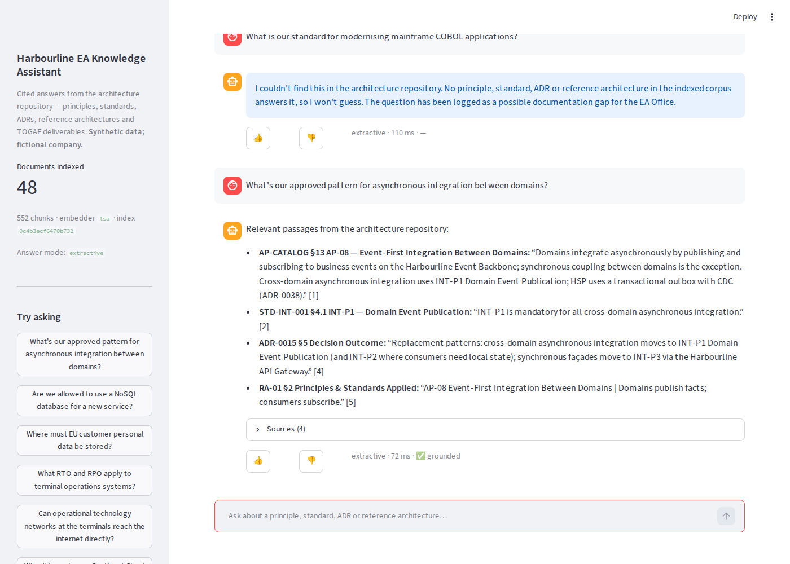
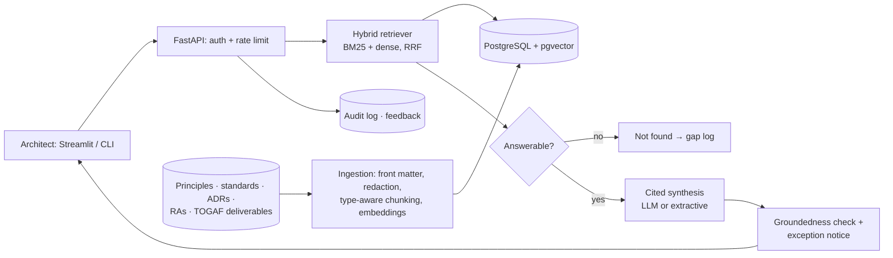

# EA Knowledge Assistant — RAG over the Architecture Repository

> Project 1 of the [Enterprise Architecture + AI Portfolio](../README.md) · Tier: Beginner · Status: **built, tested and evaluated** (offline configuration)

Architects keep re-asking questions that the repository already answers, such as *"are we allowed to
use NoSQL for this?"* or *"what's our approved async integration pattern?"*. Finding the answer takes
longer than asking a colleague. This assistant answers from the repository **only**. It cites the exact
document and clause behind each answer, and says **"not found"** instead of guessing.



## What's in this project

| | |
|---|---|
| **A realistic architecture repository** | 48 original documents (~66k words) for a fictional global freight and port-terminal operator, *Harbourline Logistics Group*: <br>• 16 principles, 15 standards, 12 ADRs and 4 reference architectures <br>• 13 deliverables following the TOGAF ADM structure: Architecture Vision, Statement of Architecture Work, Architecture Definition Document, requirements, roadmap, Architecture Contract, Compliance Assessment, Change Request and more <br>• An ARB charter, an Exceptions Register and a glossary <br>See [`data/README.md`](data/README.md). |
| **Retrieval pipeline** | Section-aware chunking by document type, so clauses are citable as `STD-INT-001 §4.1`, and ingestion-time redaction. Hybrid BM25 + dense retrieval fused with RRF, plus an answerability gate. |
| **Grounded answers** | Citation-forced prompt with a `NOT_FOUND` path, a post-generation groundedness check, and a governance notice on any question about architecture exceptions. |
| **Interfaces** | FastAPI (`/ask`, `/documents`, `/feedback`, `/health`) with API keys and rate limiting; Streamlit chat UI with 👍/👎 feedback; `eaka` CLI. |
| **Storage** | PostgreSQL + pgvector (docker-compose); an in-memory store for development and CI. |
| **Evidence** | 50-question hand-labelled evaluation with a dev/test split, 22 tests including a pgvector integration test, and GitHub Actions CI with an evaluation regression gate. |

## Architecture



The full design, including the chunking strategy, request flow and Azure/AWS deployment mapping, is in
[`docs/architecture.md`](docs/architecture.md). The design decisions are recorded in [`docs/adr/`](docs/adr).

## Quickstart

```bash
# Offline: no API keys, no database
pip install -e ".[ui,dev]"
eaka ask "Are we allowed to use a NoSQL database for a new service?"
streamlit run app/streamlit_app.py
pytest -q && python eval/run_eval.py

# Full stack: PostgreSQL + pgvector, API and UI
cp .env.example .env          # optional: set EAKA_LLM_PROVIDER + a key
docker compose up --build     # UI http://localhost:8501 · API docs http://localhost:8000/docs
```

To use an LLM, set `EAKA_LLM_PROVIDER` to `azure_openai`, `anthropic` or `openai` and supply the
matching key in `.env`. For an organisation with EU and UAE data-residency rules, the recommended
choice is **Azure OpenAI deployed in the data's own region**. The reasoning is in
[ADR-P003](docs/adr/ADR-P003-llm-and-embedding-provider.md).

## Example

The blueprint's example question is *"What's our approved pattern for asynchronous integration
between domains?"* The assistant returns:

- **Principle AP-08** (Event-First Integration Between Domains);
- **STD-INT-001 §4.1 INT-P1** Domain Event Publication, which is mandatory;
- the ADR that moves integrations off the ESB (ADR-0015);
- the reference architecture RA-01.

Each is cited by clause. For *"What is our standard for modernising mainframe COBOL applications?"* the
assistant refuses and logs the question as a documentation gap (see the screenshot above).

## Evaluation (test split, offline configuration)

| Measure | Result |
|---|---|
| Retrieval Recall@5 / Hit@1 / MRR@10 (hybrid, dev-tuned) | **100% / 86.2% / 0.910** |
| Hybrid vs. single retrievers (MRR@10) | BM25 0.880 · dense 0.898 · **hybrid 0.910** |
| Answerable questions wrongly refused | **0 of 29** |
| Out-of-corpus questions correctly refused | **6 of 7** (the miss uses only in-corpus vocabulary, so the LLM's `NOT_FOUND` rule is the second gate) |
| Answers carrying a citation | **100%** |
| Answer contains the key fact (extractive mode) | 72.4%. Quoting whole sentences is the limit here; LLM synthesis is expected to close this gap. |
| Latency p50 / p95 (in-process) | 31 ms / 39 ms |

Method, metric definitions, the full report and the commands for the LLM runs are in
[`eval/README.md`](eval/README.md) and [`eval/results/offline_baseline.md`](eval/results/offline_baseline.md).

**Still to measure:** LLM-mode groundedness and key-fact accuracy, and neural embeddings. No API key
was available when these results were produced, and the evaluation reports those numbers as pending
rather than estimating them.

## Governance: what this system does not do

It doesn't author or amend standards, and it doesn't grant, renew or judge architecture exceptions.
Any answer touching an exception says that the ARB decides. Every answer cites its source or says
"not found". Every question is logged for audit, and unanswered questions feed the EA Office's
documentation backlog. The controls and limitations are set out in
[`docs/governance-and-limitations.md`](docs/governance-and-limitations.md).

## Repository layout

```
01-ea-knowledge-assistant/
├── src/eaka/            ingest · redact · lexical (BM25) · embeddings · store (memory/pgvector)
│                        retrieval · answer · engine · querylog · api · cli
├── app/                 Streamlit UI
├── data/corpus/         48-document synthetic architecture repository (+ data/README.md)
├── data/WORLD_BIBLE.md  shared facts about the fictional enterprise (reusable by Projects 2–10)
├── eval/                queries.yaml (50 labelled questions), run_eval.py, results/
├── tests/               ingestion, retrieval/answers, API, pgvector integration
├── docs/                architecture.md, governance-and-limitations.md, adr/ (ADR-P001…P005), images/
├── infra/Dockerfile · docker-compose.yml · Makefile · .env.example   (CI: ../.github/workflows/ea-knowledge-assistant.yml)
```

---
*All data is synthetic. Harbourline Logistics Group is fictional. TOGAF® is a registered trademark of The Open Group; no Open Group text is used.*
