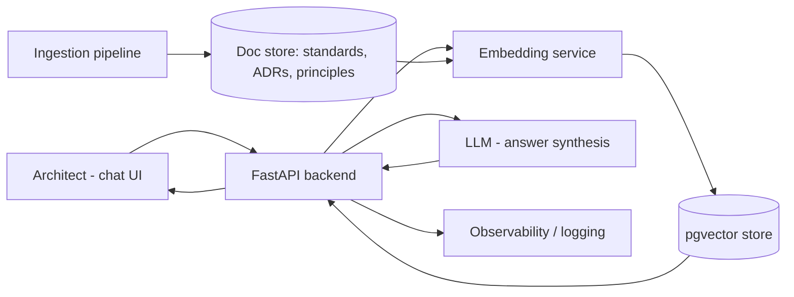

# EA Knowledge Assistant (RAG over the Architecture Repository)

> Part of the [Enterprise Architecture + AI Portfolio](../README.md) — see `../EA-AI-Portfolio-Blueprint.docx` (or `.md`) for the full specification, governance model, and (for Project 9) the complete 25-part implementation blueprint.

**Tier:** Beginner · **Repo name:** `ea-knowledge-assistant`

**Enterprise Problem.** Architecture principles, standards, ADRs, and reference models live across wikis, SharePoint, and PDFs. Architects routinely re-litigate questions ("are we allowed to use a NoSQL store for this?") that already have a documented, approved answer — because finding it takes longer than asking a colleague or guessing.

**Business Value.** Cuts time-to-answer for standards questions from hours/days to minutes; reduces inconsistent solution decisions caused by architects not finding the applicable standard. KPIs: median time-to-answer for policy questions; % of ARB findings that cite "standard was not known/found" as a root cause (target: reduce toward zero); repository search abandonment rate.

**AI Use Case.** Retrieval-Augmented Generation answers architect questions using only the indexed corpus, always returning the source clause and document, with an explicit "not found in the corpus" fallback instead of a guess. **Not delegated to AI:** authoring or amending the standards themselves, and any answer bearing on an active governance exception.

**Users.** Solution architects, application owners, new architecture hires (onboarding), ARB members preparing for a review.

**Example Scenario.** A solution architect proposing an event-driven integration asks, "What's our approved pattern for asynchronous integration between domains?" The assistant returns the relevant Integration Architecture Principle, the two approved patterns from the standards catalog, and links to two prior ADRs that applied them — instead of the architect pinging three people over Slack.

**Architecture.**

Frontend (Streamlit) → FastAPI → embedding + retrieval against pgvector → LLM synthesizes a cited answer → response includes source document + clause. A nightly ingestion job re-chunks and re-embeds any changed documents so the index never drifts far from the corpus of record.

**EA Artifacts consumed:** architecture principles, technology standards, ADRs, reference architectures. **Generated:** none authoritative — only cited answers and an "unanswered questions" log used to prioritize documentation gaps.

**AI Techniques required:** embeddings, semantic search, RAG, LLM answer synthesis with citation. *Not used:* fine-tuning (unnecessary at this scale), agents (single-turn retrieval doesn't need orchestration).

**Recommended Stack:** Python, FastAPI, Streamlit, an LLM API (OpenAI/Azure OpenAI/Anthropic — pick one and justify the choice by data-residency needs), PostgreSQL + pgvector, Docker, GitHub Actions for CI.

**Data Model:** `Document(id, type, title, source_path, version)` → `Chunk(id, document_id, text, embedding, section_ref)`. Simple by design — this project's job is proving grounded retrieval works, not modeling the enterprise.

**AI Governance:** every answer must carry a citation or explicitly state it found nothing; log every query/answer pair for audit; strip or redact any accidentally-ingested sensitive fields during ingestion; rate-limit and authenticate API access; no prompt-injection surface because there's no external/untrusted content in the corpus (documented as a design decision, revisited if that changes).

**Implementation Plan.**
- *Phase 1 (MVP):* ingest ~30–50 synthetic architecture documents; basic chunking + embedding + retrieval; simple Streamlit Q&A UI.
- *Phase 2 (AI capability):* add citation formatting, "not found" handling, and query logging.
- *Phase 3 (EA intelligence):* add document-type-aware chunking (principles vs. ADRs need different chunk boundaries) and a feedback button ("was this answer correct?") to build an evaluation set.
- *Phase 4 (production-grade):* add auth, observability (OpenTelemetry traces on retrieval latency and answer quality), and automated re-indexing on document change.

**Repo Structure:** `/app` (FastAPI + Streamlit), `/ingestion`, `/data/synthetic_standards`, `/docs` (architecture diagram, ADRs for this project itself), `/tests`, `/eval` (retrieval + groundedness test set), `README.md`.

**Portfolio Deliverables:** README with problem statement and architecture diagram; short demo video/GIF; sample synthetic standards corpus; retrieval evaluation results; a one-page "governance & limitations" section.

**Evaluation:** retrieval precision@k against a hand-labeled query set; groundedness (does the answer's claim appear in the cited chunk — checked programmatically and by spot review); latency (p50/p95); % of queries correctly returning "not found" when the answer isn't in the corpus.

**Résumé Bullets.**
- Built a retrieval-augmented Q&A system over a synthetic enterprise architecture repository, achieving grounded, citation-backed answers with a measured groundedness rate on a held-out evaluation set.
- Designed a document ingestion and chunking pipeline for heterogeneous architecture artifacts (principles, standards, ADRs), reducing simulated time-to-answer for policy questions.

**Interview Story.** *Problem:* architects can't efficiently find answers that already exist. *Constraints:* answers must be traceable to a source, not hallucinated. *Architecture:* RAG over pgvector with citation-forced prompting. *AI approach:* embeddings + retrieval, no fine-tuning needed at this scale. *Governance:* explicit "not found" behavior, full query logging. *Trade-offs:* chose pgvector over a dedicated vector DB for operational simplicity at this scale, would reconsider at enterprise volume. *Results:* quantified groundedness and precision on the eval set — not a production deployment claim.
