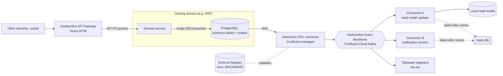

# RA-01 — Event-Driven Domain Integration

> Synthetic document for a portfolio project. Harbourline Logistics Group is a fictional company.

## 1. Purpose & Applicability

This reference architecture describes the standard way a Harbourline business domain shares state changes with other domains. It turns the patterns in STD-INT-001 into a concrete arrangement of building blocks that delivery teams can copy.

It applies to:

- every new cross-domain asynchronous integration (mandatory, per STD-INT-001 §4.1 INT-P1);
- consumers that need a local, query-optimised copy of another domain's data (INT-P2);
- replacement of MuleSoft flows being retired under ADR-0015 before 2026-12-31.

It does not apply to partner EDI exchanges (INT-P4, handled by APP-123), batch loading into Tidewater (INT-P5, see RA-04), or intra-service communication inside a single bounded context.

## 2. Principles & Standards Applied

| Reference | How it shapes this architecture |
|---|---|
| AP-08 Event-First Integration Between Domains | Domains publish facts; consumers subscribe. No polling of another domain's API to detect change. |
| AP-09 API-First for Synchronous Access | Queries and commands needing an immediate answer go through the Harbourline API Gateway (APP-121). |
| AP-07 One System of Record per Data Domain | Consumers hold read models only; they never write back to the owning domain's store. |
| AP-14 Observable by Default | Trace context travels in event headers end to end. |
| STD-EVT-003 | Topic naming, Avro + Schema Registry, BACKWARD compatibility, 7-day retention, DLQ, 1 MB limit. |
| STD-INT-001 | INT-P1, INT-P2, INT-P3; prohibition on shared databases and call chains deeper than 3 hops. |
| STD-DAT-004 | No Restricted fields in payloads unless field-level encrypted. |
| STD-OBS-010 | OpenTelemetry instrumentation, W3C trace context, no personal data in logs. |

## 3. Building Blocks

| Architecture Building Block (ABB) | Solution Building Block (SBB) / Product | Notes |
|---|---|---|
| Domain service | .NET 8 or Java 21 microservice on AKS (RA-02) | Owns its database and its events |
| Operational data store | Azure Database for PostgreSQL Flexible Server | One per domain (ADR-0024) |
| Transactional outbox | `outbox` table in the domain's PostgreSQL schema | Written in the same transaction as the business change (ADR-0038) |
| Change data capture | Confluent-managed Debezium PostgreSQL source connector | Reads WAL, publishes outbox rows |
| Event backbone | Confluent Cloud Kafka on Azure (APP-120) | ADR-0007 |
| Schema governance | Confluent Schema Registry | Avro, BACKWARD mode |
| Dead-letter handling | `<topic>.dlq` topics + DLQ replay tool | Owned by consuming team |
| Consumer read model | PostgreSQL or Azure Cache for Redis (cache only) | Idempotent upsert keyed by entity ID + version |
| Large payload store | Azure Blob Storage (claim-check) | For payloads > 1 MB, e.g. documents |
| Synchronous access | Harbourline API Gateway — Azure API Management (APP-121) | ADR-0019 |
| Cross-cloud link | Confluent cluster linking + private link | For Nordhaven TMS on AWS (ADR-0021) |
| Telemetry | OpenTelemetry SDK → Azure Monitor / Grafana | Trace ID in Kafka headers |

## 4. Diagram

## 5. Flow Description

1. The domain service handles a command (for example "record milestone") and, in one PostgreSQL transaction, updates its business tables and inserts an outbox row containing the event type, aggregate ID, aggregate version, and Avro-serialisable payload.
2. The transaction commits. If it rolls back, no event exists — the change and the event are atomic.
3. The Debezium connector reads the committed outbox row from the write-ahead log and publishes it to the topic named in the row, e.g. `shipment.milestone.recorded.v1`, keyed by aggregate ID so ordering holds per entity.
4. The serializer registers or validates the schema against Schema Registry. An incompatible schema fails the publish and raises an alert to the producing team.
5. The connector propagates `traceparent` from the outbox row into Kafka headers.
6. Each consumer group reads the topic independently. Consumers apply the event idempotently: they ignore any event whose aggregate version is less than or equal to the version already stored.
7. Transient failures are retried with exponential backoff (max 5 attempts). Poison messages go to `<topic>.dlq` with the failure reason in a header; the owning consumer team triages within one business day.
8. Consumers needing detail not carried in the event call the producer's API through APIM (INT-P3). Where this happens on every event, the event design is incomplete and SHOULD move to INT-P2.
9. A housekeeping job deletes outbox rows older than 72 hours once the connector offset confirms publication.

## 6. Non-Functional Characteristics

| Characteristic | Target | Mechanism |
|---|---|---|
| End-to-end latency (commit → consumer read model) | p95 < 30 s; supports REQ-HSP-014 (< 5 min p95) with margin | CDC streaming, no polling |
| Delivery guarantee | At-least-once; effectively-once via idempotent consumers | Outbox + version check |
| Ordering | Per aggregate (partition key) | Keyed topics |
| Availability | Backbone 99.95% (Confluent SLA, multi-zone) | Dedicated cluster in East US 2; EU cluster in West Europe |
| Security | TLS 1.2+, service principals per consumer with topic-level ACLs | STD-SEC-009, STD-IAM-008 |
| Observability | Consumer lag, DLQ depth, and connector status on the integration Grafana board | STD-OBS-010 |

## 7. Worked Example at Harbourline — Shipment Milestones

HSP (APP-022) records roughly 1.9 million milestone events per day across US lanes after Transition Architecture 1. The milestone service writes each milestone and an outbox row in one transaction. The Debezium connector publishes to `shipment.milestone.recorded.v1`; status transitions produce `shipment.status.changed.v1`.

Three consumers subscribe:

- **Harbourline Connect (APP-050)** maintains a per-region read model of shipment status (ADR-0030, INT-P2). The US stamp consumes from the East US 2 cluster. Under ADR-0041 the EU stamp consumes from the West Europe cluster so EU customer data stays in-region. Portal queries hit the read model, not HSP.
- **Customer Notification Service (APP-055)** is expected to subscribe to the same topics and decide whether to alert the customer. The G-02 compliance assessment (ARB-2026-031) found the initial CNS design polled HSP every 30 seconds instead; this reference architecture is the target design the team was directed to adopt.
- **Tidewater (APP-080)** lands the topic in bronze through a Kafka sink connector (RA-04).

Measured p95 from HSP commit to portal read model in August 2026 was 11 seconds.

## 8. Anti-Patterns

| Anti-pattern | Why it is rejected | Do instead |
|---|---|---|
| Polling another domain's REST API to detect changes | Load on producer, latency, violates AP-08 | Subscribe to the domain event |
| Dual write (DB commit then separate Kafka publish in code) | Lost or phantom events on partial failure | Transactional outbox (ADR-0038) |
| Consumer reading the producer's database or replica | Shared database prohibited by STD-INT-001 | Event-carried state (INT-P2) |
| New MuleSoft flow as a relay | Frozen since 2025-06-30 (ADR-0015) | Direct publish/subscribe on the backbone |
| Personal data in plain event payloads for convenience | Breaches STD-DAT-004 handling rules | Reference IDs, or field-level encryption |

## 9. Related ADRs

- ADR-0007 — Adopt Confluent Cloud as the Enterprise Event Backbone
- ADR-0015 — Sunset MuleSoft ESB and Freeze New Flows
- ADR-0019 — Azure API Management as the Single API Gateway
- ADR-0021 — Temporarily Retain Nordhaven TMS on AWS
- ADR-0030 — Event-Carried State Transfer for Shipment Status to Harbourline Connect
- ADR-0038 — Transactional Outbox for Publishing Domain Events from HSP
- ADR-0041 — Serve EU Customer Data for Harbourline Connect from West Europe

## 10. Document History

| Version | Date | Author | Change |
|---|---|---|---|
| 1.0 | 2024-06-18 | Amara Osei | Initial release following ADR-0007 |
| 1.2 | 2025-06-24 | Amara Osei | Outbox + CDC made the default after ADR-0038 |
| 1.3 | 2025-07-01 | Amara Osei | Regional clusters and ADR-0041 consumer placement added |
