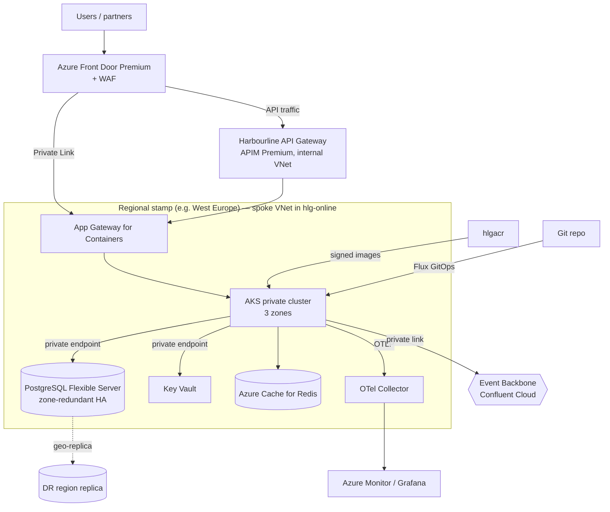

# RA-02 — Cloud-Native Application on the Azure Landing Zone

> Synthetic document for a portfolio project. Harbourline Logistics Group is a fictional company.

## 1. Purpose & Applicability

This reference architecture defines the default hosting shape for a Harbourline-built, internet- or partner-facing application on Azure. It packages the landing zone, container, database, identity, and resilience standards into one deployable pattern so that teams start compliant instead of negotiating each control at ARB.

Applies to:

- new custom applications classified Tier 1 or Tier 2 under STD-RES-015 (HSP, Harbourline Connect, Customs Filing Gateway, CNS);
- re-platforming of on-premises applications leaving the Baltimore data centre before 30 June 2027.

Out of scope: SaaS products (Salesforce, Manhattan Active WM), Tier 0 terminal systems (see RA-03), and analytics workloads (see RA-04). Very simple event handlers MAY use Azure Container Apps instead of AKS, per STD-CTR-012.

## 2. Principles & Standards Applied

| Reference | Application in this RA |
|---|---|
| AP-10 Cloud-Smart and Portable | Azure primary; Kubernetes, PostgreSQL, OpenTelemetry and Terraform keep workloads portable. |
| AP-11 Managed Services over Self-Managed | AKS, PostgreSQL Flexible Server, Key Vault, Front Door — no self-managed clusters or databases. |
| AP-12 Zero Trust Access | Private endpoints, managed identity, Entra ID authentication on every hop. |
| AP-06 Data Residency Follows Jurisdiction | Regional deployment stamps pinned to approved regions. |
| AP-14 / AP-15 | OpenTelemetry mandatory; all infrastructure in Terraform, all workloads via GitOps. |
| STD-CLD-007 | `hlg-online` or `hlg-corp` management group, mandatory tags, no public IPs on VMs. |
| STD-CTR-012 | Images from `hlgacr`, Notation signing, non-root, Helm + Flux. |
| STD-DB-006 | PostgreSQL Flexible Server as default store; Redis as cache only. |
| STD-RES-015 | Zone redundancy and paired-region DR sized to service tier. |

## 3. Building Blocks

| ABB | SBB / Product | Configuration baseline |
|---|---|---|
| Global entry & edge security | Azure Front Door Premium + WAF | OWASP managed rule set, bot protection, geo-routing |
| API mediation | Harbourline API Gateway (APIM Premium, APP-121) | Internal VNet mode; OAuth 2.0 via Entra ID |
| Compute | Azure Kubernetes Service, private cluster | 3 availability zones, Azure CNI Overlay, system + user node pools |
| Ingress controller | Application Gateway for Containers | Private Link origin from Front Door |
| Container images | Azure Container Registry `hlgacr` | Premium, geo-replicated, Notation-signed images only |
| Relational store | Azure Database for PostgreSQL Flexible Server | Zone-redundant HA, private endpoint, CMK for Restricted |
| Cache | Azure Cache for Redis | Never a system of record |
| Secrets & keys | Azure Key Vault (Premium/HSM for Restricted) | Access via workload identity only |
| Workload identity | Entra Workload ID (federated managed identity) | One identity per service |
| Events | Harbourline Event Backbone (APP-120) via private link | See RA-01 |
| Observability | OpenTelemetry Collector → Azure Monitor / Log Analytics + Grafana | 13-month retention |
| Delivery | Terraform (platform), Helm + Flux (workloads), GitHub Actions | Policy-as-code gates |

## 4. Diagram

## 5. Flow Description

1. A user request resolves to Azure Front Door, which terminates TLS 1.3, applies WAF rules and routes by path and, for customer-facing apps, by the account's home region (ADR-0041).
2. Web traffic goes via Private Link to Application Gateway for Containers inside the regional spoke; API traffic goes first to APIM, which validates the OAuth 2.0 token issued by Entra ID or Harbourline Connect ID and enforces the 1,000 req/min default rate limit.
3. The request reaches a pod in the private AKS cluster. Pods run as non-root from signed images pulled from `hlgacr`; admission policy rejects unsigned images or images with critical CVEs.
4. The service authenticates to PostgreSQL, Key Vault and Redis using its workload identity. No connection strings with passwords exist in configuration.
5. State changes are persisted in PostgreSQL and, where other domains need them, published through the outbox pattern in RA-01.
6. Every request is traced with OpenTelemetry; traces, metrics and logs flow to the regional collector and on to Azure Monitor. Logs are scrubbed of personal data at the SDK layer.
7. Deployments are pull-based: Flux reconciles the Helm release from Git; Terraform plans for platform resources run in CI with Azure Policy compliance checks before apply.

## 6. Non-Functional Characteristics

| Characteristic | Tier 1 target | How achieved |
|---|---|---|
| Availability | 99.95% | Three-zone AKS and zone-redundant PostgreSQL |
| RTO / RPO | 1 h / 15 min (STD-RES-015) | PostgreSQL geo-replica to paired region; stamp redeployed from Terraform |
| Scalability | Horizontal pod autoscaling; cluster autoscaler to 40 nodes per pool | KEDA for Kafka-lag scaling |
| Security | No public endpoints except Front Door | Private endpoints, NSGs, Azure Policy deny rules |
| Residency | Data at rest only in the stamp's region | Region pinned in Terraform module; policy denies other locations |
| Cost transparency | 100% resources tagged | Mandatory tags enforced by policy |
| Recovery testing | Annual DR test for Tier 1 | Failover runbook exercised per stamp |

## 7. Worked Example at Harbourline — Harbourline Connect Stamps

Harbourline Connect (APP-050) runs three stamps built from this RA: US (East US 2, DR Central US), EU (West Europe, DR North Europe) and Canada (Canada Central, DR Canada East). Each stamp contains its own AKS cluster, PostgreSQL read-model database and Redis cache. Front Door routes an authenticated user to the stamp matching their account's home region, satisfying STD-DAT-005 and ADR-0041. A fourth UAE North stamp is proposed under CR-2026-014 (H-01) and would be instantiated from the same Terraform module with region `uaenorth`.

The React front end and .NET 8 BFF deploy to each stamp via Flux from a single Git repository with per-region overlays. The 2026 DR test for the EU stamp failed over to North Europe in 38 minutes with 4 minutes of data loss, within Tier 1 targets.

## 8. Anti-Patterns

| Anti-pattern | Why rejected | Do instead |
|---|---|---|
| Public AKS API server or public load balancer | Expands attack surface; breaks AP-12 | Private cluster; ingress via Front Door only |
| Secrets in Helm values or pipeline variables | Credential leakage | Workload identity + Key Vault |
| One global database serving all regions | Violates AP-06 / STD-DAT-005 | Regional stamps |
| Self-managed PostgreSQL or Kafka on VMs | Operational burden; prohibited by STD-DB-006 and AP-11 | Managed services |
| Portal click-ops changes in production | Drift; not auditable | Terraform and GitOps only |
| Single-zone node pools for Tier 1 | Fails availability target | Three-zone pools |

## 9. Related ADRs

- ADR-0019 — Azure API Management as the Single API Gateway
- ADR-0024 — PostgreSQL Flexible Server as Default Relational Database
- ADR-0030 — Event-Carried State Transfer for Shipment Status to Harbourline Connect
- ADR-0041 — Serve EU Customer Data for Harbourline Connect from West Europe

## 10. Document History

| Version | Date | Author | Change |
|---|---|---|---|
| 1.0 | 2024-08-12 | Kenji Watanabe | Initial release for HSP build |
| 2.0 | 2025-06-01 | Kenji Watanabe | Regional stamp model, App Gateway for Containers, workload identity |
