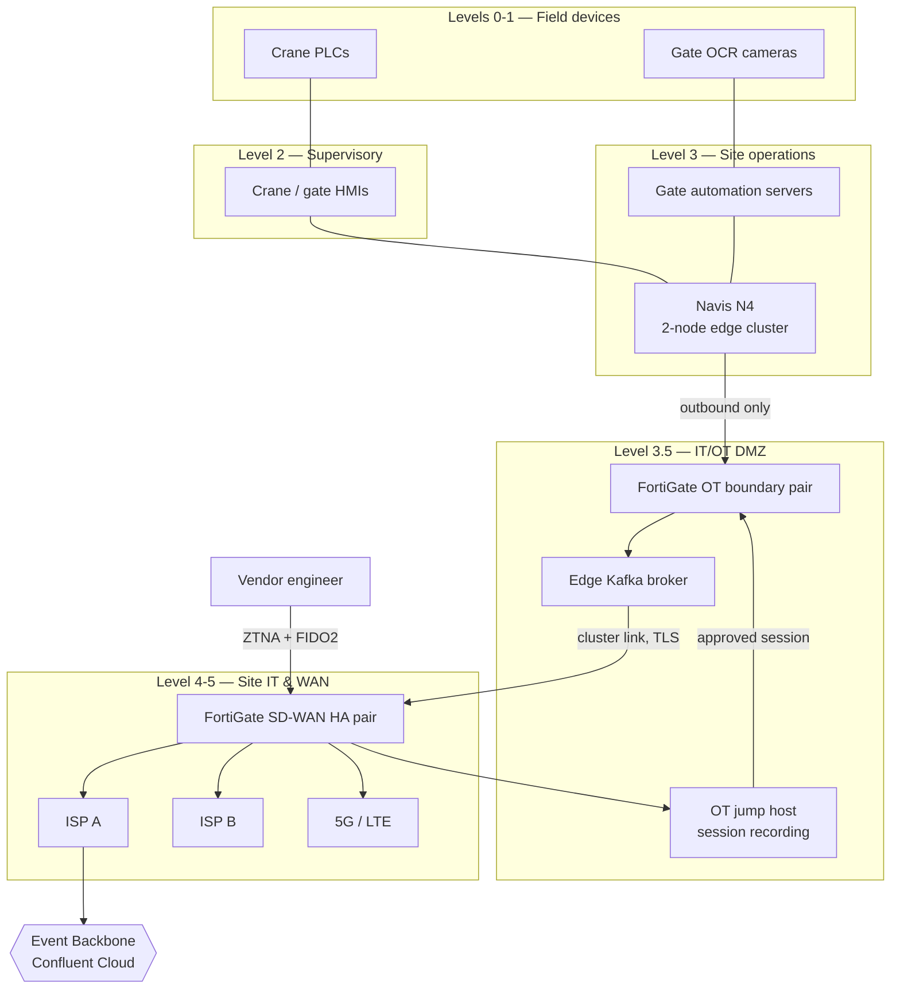

# RA-03 — Terminal Edge & OT Connectivity

> Synthetic document for a portfolio project. Harbourline Logistics Group is a fictional company.

## 1. Purpose & Applicability

This reference architecture defines how Harbourline's four container terminals (BAL-T1, HFX-T1, RTM-T2, JEA-T4) host Tier 0 operational systems at the edge, segment operational technology (OT) from corporate IT, and share data with the cloud without making quay operations dependent on it.

It applies to any system deployed in or connecting to a terminal OT network: Navis N4 (APP-030), Terminal Gate Automation (APP-031), crane and reefer-rack control interfaces, and any vendor remote-access path. It also governs how terminal data reaches HSP, the Event Backbone and Tidewater.

It is written to satisfy the US Coast Guard maritime cybersecurity rule (33 CFR Part 101 Subpart F) for BAL-T1 and EU NIS2 obligations for RTM-T2, while applying one design at all four sites.

## 2. Principles & Standards Applied

| Reference | Application |
|---|---|
| AP-04 Business Continuity at the Quay | Terminal operations continue for 72 hours with no WAN or cloud. |
| AP-13 Separate IT and OT | IEC 62443 zones and conduits; Purdue levels 0-3; mandatory IT/OT DMZ. |
| AP-12 Zero Trust Access | No standing vendor access; time-bound, recorded sessions. |
| STD-NET-011 | FortiGate SD-WAN, no internet from levels 0-2, OT jump host, SSL inspection at breakout. |
| STD-RES-015 | Tier 0: RTO 15 min, RPO 0-5 min, semi-annual DR tests. |
| STD-DAT-004 | OT/terminal configuration is Restricted. |

## 3. Building Blocks

| ABB | SBB / Product | Notes |
|---|---|---|
| Level 0-1 field devices & controllers | Crane PLCs, OCR gate cameras, reefer monitoring controllers | Vendor-supplied; no IP route beyond level 2 |
| Level 2 supervisory | Crane and gate supervisory HMIs | Zone OT-SUP |
| Level 3 site operations | Navis N4 on 2-node edge cluster (ADR-0027); gate application servers | Zone OT-OPS; local storage replicated synchronously between nodes |
| Level 3.5 IT/OT DMZ | FortiGate pair (OT boundary), DMZ broker, OT jump host, patch relay | Zone DMZ; the only conduit between IT and OT |
| DMZ data broker | Confluent Platform edge broker (single site cluster) with cluster linking to Event Backbone | One-way outbound replication |
| Remote access | OT jump host with session recording, Entra ID + FIDO2, approval in ServiceNow | Time-bound, max 8 hours (STD-IAM-008) |
| Site WAN & internet | Fortinet Secure SD-WAN FortiGate HA pair (ADR-0036) | Dual ISP + 5G/LTE backup |
| OT monitoring | Passive OT network detection sensor on span ports | Alerts forwarded to Sentinel via DMZ |
| Time source | Local GPS-disciplined NTP at level 3 | Operations independent of internet time |

## 4. Diagram

## 5. Flow Description

1. Field devices at levels 0-1 communicate only with supervisory systems at level 2 over industrial protocols inside zone conduits. They have no route to level 3.5 or above.
2. Navis N4 at level 3 receives equipment events from supervisory systems and gate transactions from the gate servers. Both nodes of the edge cluster hold a synchronous copy of the N4 database; node failure triggers automatic failover in under 5 minutes.
3. N4 integration adapters publish terminal events (for example `terminal.container.gated-in.v1`) to the DMZ edge broker. Connections are initiated from level 3 outward; the OT boundary FortiGate denies any session initiated from the DMZ or IT towards level 3 except whitelisted jump-host flows.
4. The edge broker retains 96 hours of events. Confluent cluster linking replicates topics outbound to the Event Backbone; nothing is mirrored back into the DMZ broker for OT consumption.
5. If the WAN fails, N4 and gate operations continue unaffected; events accumulate on the edge broker and replicate when connectivity returns. The 96-hour buffer exceeds the 72-hour AP-04 requirement.
6. Commands from HSP to the terminal (for example release authorisations) are fetched by an N4 adapter polling a DMZ-hosted endpoint on a 60-second interval; the cloud never opens an inbound connection into OT.
7. Vendor support requires a ServiceNow change with an approval window. The vendor authenticates through FortiGate ZTNA with FIDO2, lands on the OT jump host, and every session is recorded and retained for 24 months.
8. OT detection sensors and FortiGate logs forward to Microsoft Sentinel through the DMZ log relay.

## 6. Non-Functional Characteristics

| Characteristic | Target |
|---|---|
| Local autonomy | ≥ 72 hours without WAN/cloud (AP-04) |
| N4 RTO / RPO | 15 min / 0-5 min (Tier 0) |
| WAN availability | 99.99% via dual ISP + 5G, automatic SD-WAN path steering |
| Event freshness to cloud (normal) | p95 < 20 s from N4 commit to Event Backbone |
| Security | IEC 62443 target security level SL-2 for level 3, SL-3 for DMZ conduits |
| DR testing | Semi-annual node-loss and WAN-loss drills per terminal |

## 7. Worked Example at Harbourline — Rotterdam RTM-T2

RTM-T2 runs Navis N4 on a two-node edge cluster in the terminal building, with a third witness node in the gate house. In the March 2026 semi-annual drill, both ISP links were disconnected for 74 hours. Gate throughput stayed within 3% of the prior week, the edge broker buffered 5.1 million events, and replication to the Event Backbone completed 47 minutes after the links were restored. HSP milestone latency for Rotterdam containers breached the 5-minute target only during the outage window, which is an accepted consequence documented in ADR-0027.

A remaining gap at BAL-T1 is the 14 gate servers on Windows Server 2012 R2, running under exception EXC-2026-002 until 2026-11-30; Tomasz Nowak owns the remediation to Windows Server 2022 images.

## 8. Anti-Patterns

| Anti-pattern | Why rejected | Do instead |
|---|---|---|
| Hosting Navis N4 in the cloud "with a good WAN" | Breaks AP-04; WAN loss stops the quay | Edge cluster (ADR-0027) |
| Cloud service calling into level 3 APIs | Inbound path into OT | Outbound publish; DMZ command pickup |
| Vendor VPN directly into OT | Unrecorded, standing access | OT jump host with approval and recording |
| Internet access from HMIs for updates | Prohibited for levels 0-2 | Patch relay in DMZ |
| Flat terminal network shared with office IT | No IT/OT separation | IEC 62443 zones and conduits |
| Storing terminal configuration backups in general file shares | Restricted data mishandled | Encrypted vault with PIM access |

## 9. Related ADRs

- ADR-0027 — Edge-Hosted Terminal Operating System with Local Failover
- ADR-0036 — Replace MPLS WAN with Fortinet Secure SD-WAN
- ADR-0007 — Adopt Confluent Cloud as the Enterprise Event Backbone

## 10. Document History

| Version | Date | Author | Change |
|---|---|---|---|
| 1.0 | 2024-05-02 | Tomasz Nowak | Initial release after ADR-0027 |
| 1.3 | 2025-07-20 | Tomasz Nowak | 33 CFR Part 101 Subpart F alignment for BAL-T1 |
| 1.4 | 2025-08-15 | Tomasz Nowak | Aligned with STD-NET-011 v2.0; edge broker buffer raised to 96 h |
