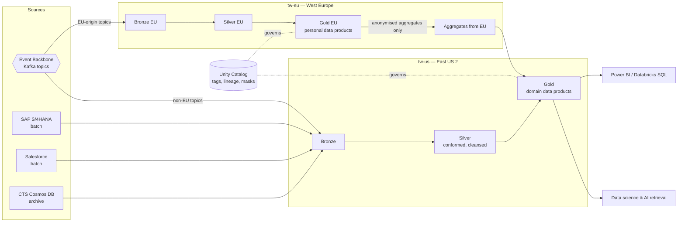

# RA-04 — Tidewater Enterprise Data Platform

> Synthetic document for a portfolio project. Harbourline Logistics Group is a fictional company.

## 1. Purpose & Applicability

Tidewater (APP-080) is Harbourline's analytical data platform. This reference architecture defines how data enters Tidewater, how it is refined, who owns it, and where personal data may reside. It is the only approved target for INT-P5 batch ingestion under STD-INT-001.

Applies to: all analytical, reporting, data-science and AI-retrieval workloads that combine data from more than one operational system. It does not cover operational integration between applications (see RA-01) or operational databases (see STD-DB-006).

## 2. Principles & Standards Applied

| Reference | Application |
|---|---|
| AP-05 Data Is an Asset with a Named Owner | Every gold data product has a named business owner and a technical steward in Unity Catalog. |
| AP-06 Data Residency Follows Jurisdiction | EU personal data processed only in the West Europe workspace. |
| AP-07 One System of Record per Data Domain | Tidewater is never a system of record; corrections are made at source. |
| AP-08 Event-First Integration | Streaming ingestion from the Event Backbone is preferred over batch extracts. |
| AP-16 Accountable Use of AI | Features and retrieval indexes built on Tidewater are registered to an AIU entry. |
| STD-DAT-004 / STD-DAT-005 | Classification tags drive access policy; TIA required for cross-border movement of personal data. |

## 3. Building Blocks

| ABB | SBB / Product | Notes |
|---|---|---|
| Storage | ADLS Gen2 (hierarchical namespace), Delta Lake format | Separate storage accounts per workspace and layer |
| Compute | Azure Databricks (Premium), serverless SQL warehouses | Workspaces: `tw-us` (East US 2), `tw-eu` (West Europe) |
| Governance & catalog | Unity Catalog | One metastore per region; lineage, tags, row/column masks |
| Streaming ingestion | Confluent-managed ADLS sink connector; Databricks structured streaming | From Event Backbone topics |
| Batch ingestion | Azure Data Factory (INT-P5) | SAP S/4HANA extracts, Salesforce, Manhattan Active WM |
| Telemetry archive | Cosmos DB → ADLS archive (ADR-0012) | 90-day hot data aged out of CTS |
| Serving | Databricks SQL, Power BI (Direct Lake / import), Delta Sharing | Delta Sharing for approved partners |
| Secrets & keys | Azure Key Vault, CMK on storage for Restricted | STD-SEC-009 |
| Data quality | Delta Live Tables expectations | Quality results published per data product |
| Evaluation track | Microsoft Fabric | Radar status Trial; not for production data products |

## 4. Diagram

## 5. Flow Description

1. **Land (bronze).** Kafka sink connectors write Event Backbone topics to bronze Delta tables with the original payload, schema ID, topic, partition and offset. Batch sources land via Data Factory on a nightly schedule (SAP finance at 02:00 ET). Bronze is append-only and retained for 13 months.
2. **Route by residency.** Topics carrying EU data-subject personal data (for example Harbourline Europe customer contacts) are landed only in `tw-eu`. The routing table is maintained by Lena Vogel and reviewed by the DPO, Marieke de Vries, each quarter.
3. **Conform (silver).** Structured-streaming and DLT pipelines deduplicate by event ID, apply schema evolution, standardise reference data (UN/LOCODE, ISO country, carrier SCAC), and apply classification tags from STD-DAT-004.
4. **Publish (gold).** Domain teams build data products — for example `shipment_performance_daily` — with a published contract: owner, freshness SLO, quality expectations, and classification.
5. **Aggregate across regions.** EU gold products export only anonymised aggregates (k-anonymity ≥ 10, no direct or indirect identifiers) to `tw-us` for group reporting. Pseudonymised data does not qualify and stays in West Europe.
6. **Consume.** Analysts use Databricks SQL or Power BI; data scientists use governed notebooks. Access is granted to Entra ID groups through Unity Catalog; Restricted columns are masked unless the user holds an active PIM elevation.
7. **Retire.** Data products follow the retention attached to their classification; deletion requests for personal data are propagated from the source system via tombstone events.

## 6. Non-Functional Characteristics

| Characteristic | Target |
|---|---|
| Freshness — streaming products | ≤ 15 min from event to silver |
| Freshness — batch products | Available by 06:00 local time of the owning region |
| Availability | 99.9% for SQL warehouses (Tier 2) |
| RTO / RPO | 8 h / 1 h (STD-RES-015 Tier 2); ADLS GRS within jurisdiction pairs |
| Scale | ~40M telemetry events/day from CTS plus ~6M business events/day |
| Security | Private endpoints, no public workspace access, CMK for Restricted |
| Cost control | Serverless warehouses auto-stop at 10 min; cluster policies per team |

## 7. Worked Example at Harbourline — On-Time Performance Data Product

The Ocean & Air Forwarding unit needed a single on-time performance measure across FreightMaster, Nordhaven TMS and HSP. The HSP milestone topic `shipment.milestone.recorded.v1` streams into bronze; FreightMaster data arrives by nightly batch until its retirement; Nordhaven TMS milestones replicate from AWS via cluster linking (ADR-0021) and land in `tw-eu` because they include EU consignee contacts.

Silver pipelines map all three sources to a common milestone model. The gold product `shipment_performance_daily` is owned by the VP Ocean Forwarding with Lena Vogel as steward. EU volumes contribute anonymised lane-level counts to the group view in `tw-us`. The product feeds the Horizon 2028 KPI dashboard used by Grace Liu for the visibility goal.

## 8. Anti-Patterns

| Anti-pattern | Why rejected | Do instead |
|---|---|---|
| Operational apps reading gold tables to make transactional decisions | Tidewater is not a system of record (AP-07) | Consume domain events (RA-01) |
| Copying EU personal data into `tw-us` "for convenience" | Violates STD-DAT-005 | Anonymised aggregates or EU-side processing |
| Direct JDBC extracts from production databases | Load and coupling | CDC via the Event Backbone |
| Ownerless shared "sandbox" gold tables | Breaks AP-05 | Registered data product with owner |
| Building AI retrieval indexes without an AIU entry | Breaches STD-AI-013 | Register the use case first |

## 9. Related ADRs

- ADR-0007 — Adopt Confluent Cloud as the Enterprise Event Backbone
- ADR-0012 — Use Azure Cosmos DB for Container Telemetry Storage
- ADR-0021 — Temporarily Retain Nordhaven TMS on AWS

## 10. Document History

| Version | Date | Author | Change |
|---|---|---|---|
| 1.0 | 2024-09-30 | Lena Vogel | Initial release |
| 1.2 | 2025-07-15 | Lena Vogel | West Europe workspace and aggregate-export rule added |
