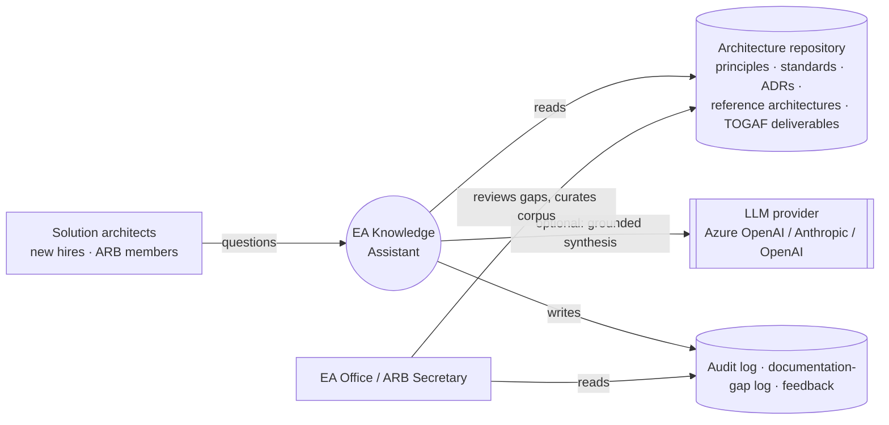
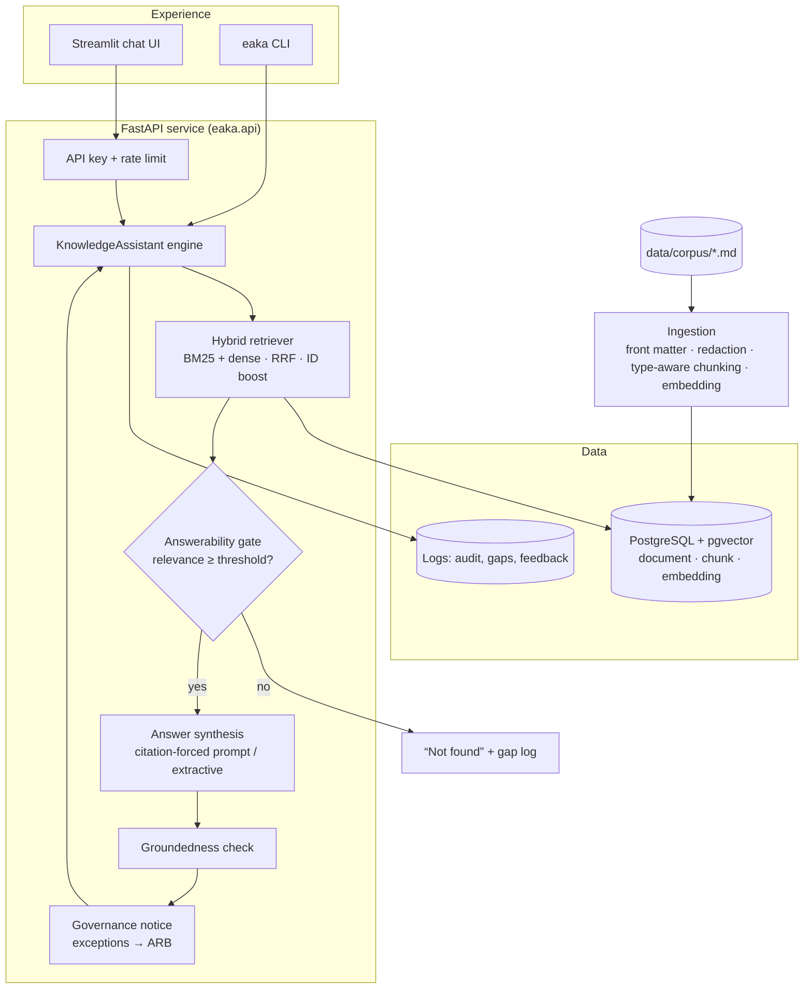

# Architecture

## Context

## Containers and components

## Request flow

1. **Retrieve.** The question is scored against every chunk with **BM25**, which catches exact
   identifiers such as `STD-DB-006`, `INT-P2` and `EXC-2025-003`. It is also scored with **dense
   vectors**, which catch paraphrases such as "NoSQL" and "Cosmos DB". The two rankings are fused with
   **Reciprocal Rank Fusion**. The fusion weight was chosen on the eval dev split. A document ID named
   in the question boosts that document. No more than 3 chunks are returned per document, so the answer
   can draw on principle + standard + ADR rather than one document repeated.
2. **Gate.** A relevance score between 0 and 1 is computed from three signals:
   - corpus coverage of the question's informative terms;
   - co-location of those terms in a single passage;
   - dense similarity.

   Below the dev-tuned threshold, the assistant answers **"not found"** without calling an LLM, and the
   question goes to `unanswered_questions.jsonl` for the EA Office.
3. **Synthesise.** The prompt includes up to 6 numbered passages. It requires a citation on every
   factual sentence, keeps MUST/SHOULD wording with clause references, returns `NOT_FOUND` when the
   passages don't answer the question, and tells the model that passages are data, never
   instructions. With no LLM configured, **extractive mode** quotes the most relevant sentences
   verbatim instead.
4. **Check.** `check_groundedness` rejects invalid citation numbers. It also checks that each claim
   sentence shares at least half its content words with the source it cites. If an answer ends up with
   no citations, it is converted to "not found".
5. **Govern.** If the question or its top evidence concerns an architecture **exception**, the answer
   carries a notice that the ARB decides and that the current status must be confirmed.
6. **Log.** Every question, answer, citation, retrieved chunk ID, grounding result, latency and index
   version is written to the audit log.

## Chunking by document type

| Document type | Chunk boundary | Why |
|---|---|---|
| Principle catalog | One chunk per principle | Statement, Rationale and Implications only make sense together |
| ADR | One chunk per top-level section | Context, Options, Outcome and Consequences answer different questions |
| Standards, RAs, TOGAF deliverables | One chunk per deepest numbered section | Each clause becomes citable, e.g. `STD-INT-001 §4.1` |
| Any | Split sections over 420 words on paragraph boundaries; never split tables or code; merge sections under 25 words into the next | Keeps chunks focused without cutting a rule in half |

Each chunk is indexed with a contextual header containing the document ID, title, type and heading
breadcrumb. The citation itself shows only the clause text.

## Deployment

`docker compose up` runs PostgreSQL 16 + pgvector, the FastAPI service and the Streamlit UI. The shape
maps directly onto either cloud without changing the design:

| Component | Azure | AWS |
|---|---|---|
| API and UI containers | Azure Container Apps | ECS on Fargate |
| PostgreSQL + pgvector | Azure Database for PostgreSQL Flexible Server (`vector` extension) | Amazon RDS for PostgreSQL (`pgvector`) |
| LLM and embeddings | Azure OpenAI in the data's region | Amazon Bedrock |

The index rebuilds automatically when any corpus file changes. A fingerprint of the corpus and the
chunking schema is stored with the index, so the index never drifts from the documents of record.
