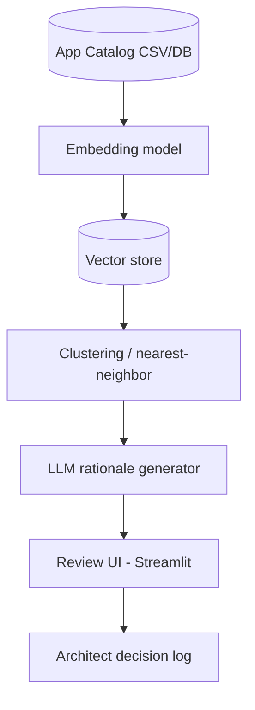

# Application Portfolio Semantic Redundancy Detector

> Part of the [Enterprise Architecture + AI Portfolio](../README.md) — see `../EA-AI-Portfolio-Blueprint.docx` (or `.md`) for the full specification, governance model, and (for Project 9) the complete 25-part implementation blueprint.

**Tier:** Beginner · **Repo name:** `app-portfolio-redundancy-detector`

**Enterprise Problem.** Application catalogs describe systems inconsistently — "Customer Engagement Hub," "CRM Lite," and "Client Relationship Tracker" may be the same capability wearing three names across three business units. Keyword search and manual review both miss this; it's discovered years later during a merger or a cost review.

**Business Value.** Surfaces redundancy candidates for architect review instead of relying on tribal knowledge. KPIs: number of validated redundant-application pairs found per 100 applications reviewed; estimated license/support cost of confirmed duplicates; reduction in application count post-rationalization cycle.

**AI Use Case.** Embed each application's name, description, and capability tags; cluster and rank nearest neighbors as redundancy candidates; an LLM writes a short rationale for *why* two applications look similar. **Not delegated to AI:** the retire/consolidate decision — a false positive here (two genuinely distinct systems) has real cost, so every candidate is a suggestion an architect confirms against actual usage.

**Users.** Enterprise architects, application portfolio managers, CIO/CTO (for portfolio cost conversations).

**Example Scenario.** A synthetic 300-application catalog across five business units is loaded. The tool clusters "CRM Lite" (Sales), "Client Relationship Tracker" (Regional Ops), and "Customer Engagement Hub" (Marketing) into one candidate cluster with 0.89 similarity, and the LLM notes: "All three manage customer contact records and interaction history; descriptions suggest overlapping CRM capability — recommend architect review for consolidation."

**Architecture.**

**EA Artifacts consumed:** application catalog, business capability map (for capability-aligned clustering). **Generated:** a redundancy candidate report linked back to the capability map.

**AI Techniques required:** embeddings, unsupervised clustering (HDBSCAN or cosine-similarity nearest-neighbor), LLM summarization. *Not used:* classification (there's no fixed label set — this is a similarity problem, not a classification problem); agents (single-pass batch job, no multi-step reasoning needed).

**Recommended Stack:** Python, sentence-transformers or an embeddings API, scikit-learn/HDBSCAN, pandas, PostgreSQL + pgvector, Streamlit for the review UI.

**Data Model:** `Application(id, name, description, business_unit, capability_tags[], cost, owner)` with a derived `SimilarityPair(app_a, app_b, score, llm_rationale, architect_decision)`.

**AI Governance:** every cluster is a *candidate*, never an automatic action; architect decision (confirmed duplicate / not a duplicate / needs more data) is logged for traceability and to build a growing labeled dataset for evaluating precision over time; no sensitive data involved beyond internal catalog metadata.

**Implementation Plan.**
- *Phase 1:* load synthetic catalog, generate embeddings, nearest-neighbor similarity report (no LLM yet).
- *Phase 2:* add LLM rationale generation and a review UI with accept/reject.
- *Phase 3:* incorporate capability-map alignment so clustering considers structured capability tags, not just free text; add cost-weighted prioritization of which clusters to review first.
- *Phase 4:* add a feedback loop where confirmed/rejected pairs retrain the similarity threshold; add a simple dashboard of estimated consolidation savings.

**Repo Structure:** `/data/synthetic_app_catalog.csv`, `/src` (embedding, clustering, LLM rationale modules), `/app` (Streamlit review UI), `/eval`, `/docs`, `README.md`.

**Portfolio Deliverables:** README, architecture diagram, synthetic dataset, before/after portfolio count example, screenshots of the review UI, precision results on a hand-labeled validation subset.

**Evaluation:** precision of top-k candidate pairs against a hand-labeled "true duplicate" set within the synthetic data; reviewer time saved vs. simulated manual pairwise comparison baseline.
