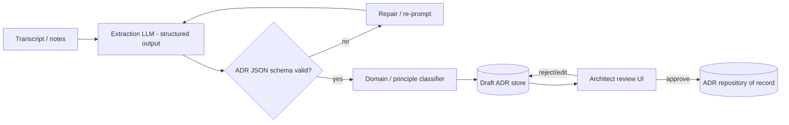

# Architecture Decision Record (ADR) Copilot

> Part of the [Enterprise Architecture + AI Portfolio](../README.md) — see `../EA-AI-Portfolio-Blueprint.docx` (or `.md`) for the full specification, governance model, and (for Project 9) the complete 25-part implementation blueprint.

**Tier:** Intermediate · **Repo name:** `adr-copilot`

**Enterprise Problem.** Real architecture decisions get made in meetings, design reviews, and Slack threads, and are rarely written up as formal ADRs afterward — so six months later nobody can reconstruct *why* a decision was made, and it gets silently reversed or re-litigated.

**Business Value.** Increases ADR capture rate without adding architect workload; preserves institutional memory that reduces repeated debate and re-work. KPIs: ADRs captured per quarter vs. decisions actually made (estimated via meeting count); average time from decision to documented ADR; % of ADRs later found "still accurate" at 12-month review.

**AI Use Case.** Given a meeting transcript, design doc thread, or bullet notes, the LLM extracts a structured ADR (context, decision drivers, options considered, decision, consequences) and classifies it by architecture domain and affected principles, using structured output (JSON schema) rather than free text. **Not delegated to AI:** the decision content itself is never invented — the copilot only extracts what was actually discussed; if the input doesn't contain a clear decision, it says so rather than fabricating one.

**Users.** Solution architects, enterprise architects maintaining the ADR log, ARB secretariat.

**Example Scenario.** A design review transcript discusses choosing Kafka over point-to-point REST calls for an order-events integration. The copilot drafts ADR-0142: context (growing number of consumers needing order events), options considered (point-to-point REST, message queue, event stream), decision (Apache Kafka), consequences (new operational dependency, but decouples 6 planned consumers), and tags it against the Integration Architecture principle — for the architect to edit and approve.

**Architecture.**

**EA Artifacts consumed:** meeting transcripts/notes, architecture principles (for classification). **Generated:** draft ADRs, which become authoritative ADRs only after human approval.

**AI Techniques required:** LLM with structured/function-calling output (JSON schema enforcement), text classification (domain/principle tagging). *Not used:* RAG isn't the core mechanism here (input is the transcript itself, though principle classification can optionally retrieve the principle list); agents aren't needed for a single extract-then-classify pipeline.

**Recommended Stack:** Python, an LLM API with structured output/function calling, Pydantic for schema validation, FastAPI, a lightweight review UI (React or Streamlit), PostgreSQL for the ADR store.

**Data Model:** `ADR(id, title, status[draft|approved|superseded], context, options[], decision, consequences, domain, related_principles[], source_transcript_id, author, approver, created_at)`.

**AI Governance:** hard schema validation before anything reaches the review queue; explicit "insufficient information to draft an ADR" fallback; every approved ADR retains a link to its source transcript for auditability; no ADR is ever auto-published without a named human approver.

**Implementation Plan.**
- *Phase 1:* structured extraction from clean, synthetic transcript text into the ADR schema; manual review UI.
- *Phase 2:* add domain/principle classification and confidence scoring.
- *Phase 3:* handle messier inputs (multi-topic meetings, partial decisions) and add a "needs more info" path.
- *Phase 4:* add ADR-to-ADR conflict detection (does this decision contradict a still-active prior ADR?) using the knowledge graph from Project 5.

**Repo Structure:** `/data/synthetic_transcripts`, `/src/extraction`, `/src/classification`, `/app`, `/schemas` (JSON schema for ADR), `/eval`, `README.md`.

**Portfolio Deliverables:** README, sample transcripts and resulting ADRs (before/after), architecture diagram, schema validation test results, screenshots of the review workflow.

**Evaluation:** schema-validity rate on first pass; extraction accuracy against hand-authored reference ADRs for the same synthetic transcripts (precision/recall on key fields); classification accuracy for domain/principle tagging.
