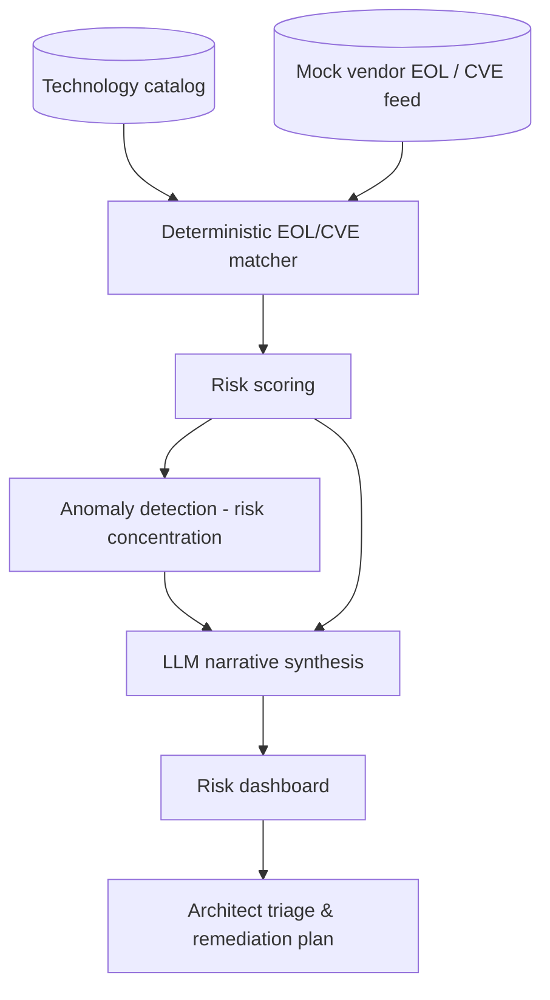

# Technology Lifecycle & EOL Risk Radar

> Part of the [Enterprise Architecture + AI Portfolio](../README.md) — see `../EA-AI-Portfolio-Blueprint.docx` (or `.md`) for the full specification, governance model, and (for Project 9) the complete 25-part implementation blueprint.

**Tier:** Intermediate · **Repo name:** `tech-lifecycle-risk-radar`

**Enterprise Problem.** Vendor end-of-support dates, CVE exposure, and product roadmap changes are usually discovered reactively — during an incident or a renewal negotiation — rather than tracked continuously against the technology catalog.

**Business Value.** Converts lifecycle risk from a periodic audit into a continuously visible signal. KPIs: number of at-risk technologies flagged before vs. after an EOL/EOS deadline; mean lead time between risk detection and remediation planning; technology catalog coverage (% of catalog with a current lifecycle status).

**AI Use Case.** Deterministic rules do the actual EOL-date comparison and CVE matching (this is *not* an AI problem); an anomaly-detection pass flags unusual risk concentration (e.g., a business capability suddenly dependent on three separately-flagged technologies); an LLM synthesizes the readable risk narrative and suggested next steps per capability, citing the underlying facts. **Not delegated to AI:** the EOL date lookup and CVE severity scoring themselves — those must be exact and come from authoritative feeds, not a language model's approximation.

**Users.** Technology/infrastructure architects, security architects, CIO/CTO (portfolio risk view), application owners.

**Example Scenario.** The radar ingests a synthetic technology catalog with versions and a mocked EOL/CVE feed. It flags that the Payments capability depends on two components reaching end-of-support within 90 days and one with a high-severity open CVE, and the LLM drafts: "Payments capability carries concentrated technology risk: [Component A] EOS in 62 days, [Component B] EOS in 88 days, [Component C] has an unpatched high-severity CVE. Recommend prioritizing this capability in the next remediation cycle" — with every claim linked to its source record.

**Architecture.**

**EA Artifacts consumed:** technology catalog, capability-to-technology mapping. **Generated:** a risk register entry per finding, with narrative.

**AI Techniques required:** anomaly/outlier detection (risk concentration across a capability), LLM narrative generation grounded in the scored facts. Deliberately *not* used for the core matching logic: rules/deterministic joins are strictly more reliable and auditable for date and CVE comparison than an LLM would be.

**Recommended Stack:** Python, pandas for rule matching, scikit-learn for anomaly detection (e.g., isolation forest over risk-signal density per capability), an LLM API for narrative generation, PostgreSQL, a lightweight dashboard (Streamlit or a simple React app).

**Data Model:** `Technology(id, name, version, vendor, eos_date, eol_date)` → `CapabilityTechnologyMap(capability_id, technology_id)` → `Vulnerability(id, technology_id, cve_id, severity, published_date)` → `RiskFinding(id, capability_id, risk_score, narrative, status)`.

**AI Governance:** every narrative claim must trace to a specific `RiskFinding` record — no free-floating LLM claims; risk scores are fully deterministic and reproducible (same inputs, same score) so they can be audited; findings feed a risk register but never auto-trigger remediation actions.

**Implementation Plan.**
- *Phase 1:* deterministic EOL/CVE matching against a synthetic catalog and mock feed; simple scoring.
- *Phase 2:* add LLM narrative generation grounded strictly in the scored records.
- *Phase 3:* add capability-level anomaly detection for risk concentration, not just per-technology flags.
- *Phase 4:* add a trend view (risk score over time) and export to a standard risk-register format.

**Repo Structure:** `/data/synthetic_tech_catalog`, `/data/mock_eol_cve_feed`, `/src/rules`, `/src/anomaly`, `/src/narrative`, `/app`, `/eval`, `README.md`.

**Portfolio Deliverables:** README, architecture diagram, sample risk register output, dashboard screenshots, an explicit "what's deterministic vs. AI-generated" section (this distinction is itself a portfolio talking point).

**Evaluation:** matching accuracy against the synthetic ground truth (should be ~100% since it's deterministic — the interesting metric is the anomaly detector's precision/recall on injected synthetic risk-concentration scenarios); narrative faithfulness (does every sentence trace to a real finding — checked programmatically).

**Résumé Bullets.**
- Designed a technology lifecycle risk system combining deterministic EOL/CVE matching with anomaly detection to surface concentrated architecture risk at the business-capability level.
- Used an LLM strictly for grounded narrative synthesis over pre-computed risk scores, deliberately avoiding LLM use for the factual matching logic to preserve auditability.

**Interview Story.** *Problem:* lifecycle risk is discovered reactively. *Constraints:* the facts (dates, CVEs) must be exact, not LLM-approximated. *Architecture:* rules engine for facts, anomaly detection for pattern-finding, LLM only for narrative. *AI approach:* this project is explicitly a case study in *not* over-using AI — a strong interview point about judgment. *Governance:* full traceability from narrative sentence to source record. *Trade-offs:* discussed why an LLM was excluded from the core matching logic. *Results:* deterministic matching accuracy plus anomaly-detector precision/recall on synthetic scenarios.
