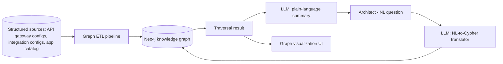

# Architecture Dependency Knowledge Graph & Impact Analyzer

> Part of the [Enterprise Architecture + AI Portfolio](../README.md) — see `../EA-AI-Portfolio-Blueprint.docx` (or `.md`) for the full specification, governance model, and (for Project 9) the complete 25-part implementation blueprint.

**Tier:** Intermediate · **Repo name:** `ea-dependency-graph`

**Enterprise Problem.** "What breaks if we retire this application / change this API / migrate this database?" is one of the most common and most poorly answered questions in EA, because dependencies live in diagrams, tickets, and people's memory rather than one queryable model.

**Business Value.** Turns impact analysis from a multi-day investigation into a query. KPIs: time required for impact analysis (before/after); number of previously-unknown dependencies surfaced per analysis; reduction in change-related incidents attributable to missed dependencies.

**AI Use Case.** The graph itself (capability → application → API → data entity → technology → infrastructure) is built from structured source data, not inferred by an LLM. AI's role is a natural-language-to-graph-query translator so an architect can ask "what depends on the Customer Master data entity?" in plain English and get a correct, explainable graph traversal back — plus an LLM that summarizes a multi-hop traversal result into plain language. **Not delegated to AI:** the graph's edges themselves must come from real configuration/integration data, not LLM inference, or impact analysis will be wrong exactly when it matters most.

**Users.** Solution architects (pre-change impact analysis), enterprise architects, application owners, change advisory boards.

**Example Scenario.** An architect asks, "If we retire the Legacy Billing Application, what else is affected?" The system translates this to a graph traversal, returns three dependent applications, two downstream reporting feeds, and one business capability (Revenue Recognition) that would lose data lineage — and the LLM summarizes: "Retiring Legacy Billing directly affects 3 applications and 2 reporting feeds; Revenue Recognition capability depends on data currently sourced only from this system — recommend confirming a replacement source before proceeding."

**Architecture.**

**EA Artifacts consumed:** application catalog, integration/API inventories, data entity catalog, technology catalog. **Generated:** dependency maps and impact-analysis reports linkable to a proposed change or ADR.

**AI Techniques required:** knowledge graphs, NLP (natural-language-to-query translation, ideally with function-calling to a constrained query template rather than free-form Cypher generation to control risk of malformed/unsafe queries), LLM summarization of traversal results. *Not used:* the graph construction itself is deterministic ETL, not AI-inferred.

**Recommended Stack:** Python, Neo4j (or a property graph library for a lighter footprint), an LLM API for NL translation and summarization, FastAPI, a graph visualization library (e.g., a Cytoscape.js-based front end), Docker.

**Data Model:** Nodes — `Capability`, `Application`, `API`, `DataEntity`, `Technology`, `Infrastructure`; Edges — `SUPPORTS` (App→Capability), `EXPOSES` (App→API), `CONSUMES`/`PRODUCES` (App↔DataEntity), `RUNS_ON` (App→Technology/Infrastructure). This schema is exactly what makes multi-hop impact analysis possible: a single traversal from `DataEntity` to `Capability` answers "what business function loses functionality" questions a flat spreadsheet never could.

**AI Governance:** constrain NL-to-query translation to a small set of vetted query templates (rather than letting the LLM emit arbitrary Cypher against a live graph) to prevent malformed or unbounded queries; log every translated query alongside the original question for audit and for catching mistranslations; summaries must only restate what the traversal actually returned.

**Implementation Plan.**
- *Phase 1:* build the graph schema and load synthetic data via deterministic ETL; basic Cypher queries via a fixed UI (no NL yet).
- *Phase 2:* add the NL-to-query translation layer (constrained templates) and result summarization.
- *Phase 3:* add graph visualization for impact analysis and multi-hop "what-if retirement" queries.
- *Phase 4:* connect to Project 4's risk findings and Project 2's redundancy candidates as additional graph node properties, turning this into the shared substrate for the capstone (Project 10).

**Repo Structure:** `/data/synthetic_sources`, `/etl`, `/graph_schema`, `/src/nl_translation`, `/app` (viz + query UI), `/eval`, `README.md`.

**Portfolio Deliverables:** README, graph schema diagram, architecture diagram, example impact-analysis walkthrough with screenshots, translation-accuracy evaluation results.

**Evaluation:** NL-to-query translation accuracy against a hand-written set of question/expected-query pairs; traversal correctness (does the graph return the right answer for known synthetic scenarios); summarization faithfulness (does the summary only state what the traversal returned).

**Résumé Bullets.**
- Built a Neo4j-based enterprise architecture knowledge graph connecting capabilities, applications, APIs, data entities, and technology, enabling multi-hop impact analysis.
- Implemented a constrained natural-language-to-graph-query interface, letting architects ask plain-English impact questions while preventing unbounded or malformed query generation.

**Interview Story.** *Problem:* impact analysis relies on institutional memory instead of a queryable model. *Constraints:* the graph's correctness depends on real source data, and NL-to-query translation must be safe against a live graph. *Architecture:* deterministic graph ETL + constrained NL translation + LLM summarization. *AI approach:* NLP for the interface, not for the underlying facts. *Governance:* query templates instead of free-form generated Cypher; full query audit log. *Trade-offs:* template-constrained translation sacrifices some flexibility for safety and predictability — a deliberate, defensible choice. *Results:* translation accuracy and traversal correctness on synthetic evaluation scenarios.
