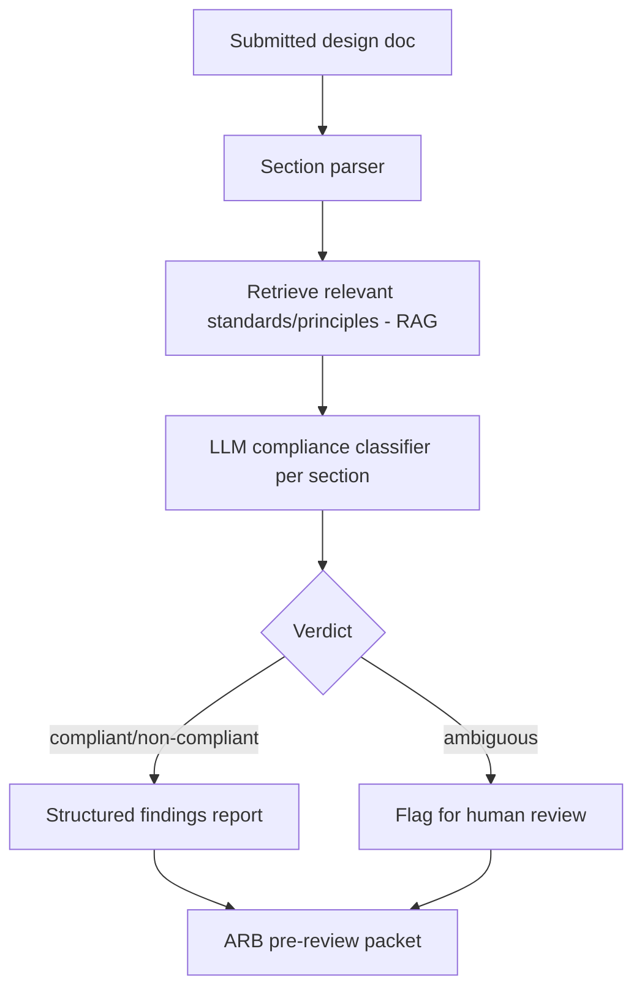

# Solution Architecture Standards Compliance Checker

> Part of the [Enterprise Architecture + AI Portfolio](../README.md) — see `../EA-AI-Portfolio-Blueprint.docx` (or `.md`) for the full specification, governance model, and (for Project 9) the complete 25-part implementation blueprint.

**Tier:** Advanced · **Repo name:** `solution-compliance-checker`

**Enterprise Problem.** Checking a submitted solution architecture document against every applicable principle, standard, and prior ADR is tedious and inconsistent between reviewers — one architect catches a data-residency violation another misses, simply because nobody can hold the entire standards corpus in their head during a review.

**Business Value.** Makes ARB pre-review consistent and fast, and gives architects self-service compliance feedback before formal submission. KPIs: ARB review cycle time; number of compliance issues caught pre-submission vs. during formal review; reviewer time spent per submission.

**AI Use Case.** RAG-grounded classification: the submitted document is parsed into sections (data handling, integration approach, technology choices, security controls), each section is checked against the relevant retrieved standards/principles, and each finding is emitted as `{clause, requirement, submission_excerpt, verdict: compliant/non-compliant/needs-human-review, citation}`. **Not delegated to AI:** any "needs-human-review" verdict is mandatory whenever the check is ambiguous or the standard itself is open to interpretation — the tool is explicitly forbidden from forcing a binary pass/fail on genuinely ambiguous cases.

**Users.** Solution architects (self-check before submission), ARB members, architecture governance lead.

**Example Scenario.** A submitted design proposes storing EU customer data in a US-region database. The checker retrieves the Data Residency principle, flags a non-compliant finding with the exact clause cited and the offending excerpt highlighted, while a separate finding about a caching strategy is marked "needs human review" because the standard doesn't unambiguously cover that pattern.

**Architecture.**

**EA Artifacts consumed:** architecture principles, technology standards, prior ADRs, security/data policies. **Generated:** a structured compliance findings report attached to the submission for ARB review — advisory, not a gate that blocks submission on its own.

**AI Techniques required:** RAG (grounding checks in the actual standards text), LLM classification with structured output, semantic search (matching design sections to the *relevant* subset of a large standards corpus). *Not used:* agents (this is a single-pass check-and-report workflow, escalated to Project 9 when the multi-step ARB process itself is automated).

**Recommended Stack:** Python, FastAPI, an LLM API with structured output, PostgreSQL + pgvector for the standards corpus (can reuse Project 1's index), a document parser (e.g., for docx/markdown sections), Streamlit for the report view.

**Data Model:** `Submission(id, title, sections[], submitted_by, status)` → `Finding(id, submission_id, section, principle_id, verdict, citation, excerpt, human_reviewed)`.

**AI Governance:** every finding must cite the specific clause it's checking against; ambiguous cases are forced to "needs human review," never guessed; the tool never blocks a submission itself — it only informs the ARB's existing process; false "non-compliant" findings are logged when overturned by a human, building an evaluation set over time.

**Implementation Plan.**
- *Phase 1:* parse synthetic design docs into sections; manual mapping to a small standards set; basic pass/fail.
- *Phase 2:* add RAG retrieval so checks scale to a larger standards corpus without hardcoded mapping.
- *Phase 3:* add the ambiguous/needs-human-review path and structured findings report generation.
- *Phase 4:* integrate with Project 9's agentic workflow as the "standards-check agent" component.

**Repo Structure:** `/data/synthetic_designs`, `/data/synthetic_standards` (shared with Project 1), `/src/parsing`, `/src/compliance_check`, `/app`, `/eval`, `README.md`.

**Portfolio Deliverables:** README, architecture diagram, sample non-compliant/compliant/ambiguous findings, precision/recall against a hand-labeled set, screenshots of the ARB packet output.

**Evaluation:** classification accuracy (compliant/non-compliant/ambiguous) against a hand-labeled synthetic set; citation correctness (does the cited clause actually support the verdict); false-non-compliance rate.

**Résumé Bullets.**
- Built a RAG-grounded architecture compliance checker that classifies solution design sections against a standards corpus with cited, structured findings.
- Designed an explicit ambiguity-escalation path so the system defers to human review rather than forcing uncertain compliance calls, reducing false-positive governance findings.

**Interview Story.** *Problem:* manual standards compliance checking is slow and inconsistent. *Constraints:* the tool must never force a confident answer on a genuinely ambiguous case. *Architecture:* RAG-grounded per-section classification with a mandatory escalation path. *AI approach:* classification + retrieval, not agents — the workflow is single-pass by design at this stage. *Governance:* citation-forced verdicts, human override logging. *Trade-offs:* precision vs. recall tuned toward flagging more "needs review" cases rather than risking a wrong pass/fail. *Results:* classification accuracy and citation correctness on a labeled synthetic set.
