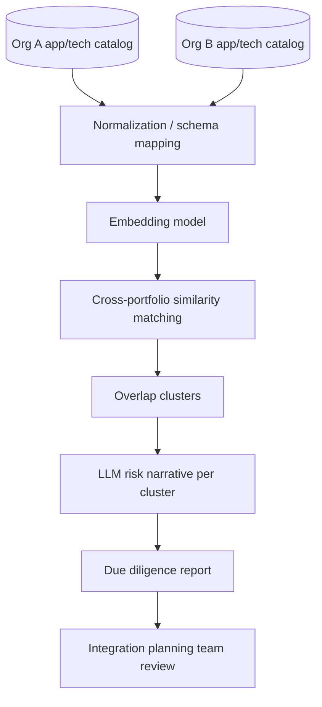

# M&A / Divestiture Architecture Due Diligence Assistant

> Part of the [Enterprise Architecture + AI Portfolio](../README.md) — see `../EA-AI-Portfolio-Blueprint.docx` (or `.md`) for the full specification, governance model, and (for Project 9) the complete 25-part implementation blueprint.

**Tier:** Advanced · **Repo name:** `ma-architecture-due-diligence`

**Enterprise Problem.** During a merger, two organizations' application and technology portfolios must be compared for overlap, integration risk, and rationalization opportunity — under a deal timeline measured in weeks, using inconsistent naming, taxonomies, and documentation quality on both sides.

**Business Value.** Turns a multi-month manual reconciliation into a structured first pass in days, so architects spend the deal window on judgment rather than data wrangling. KPIs: time to first-draft integration assessment; number of overlapping applications/capabilities identified; estimated consolidation savings identified pre-close vs. historically found post-close.

**AI Use Case.** Cross-portfolio semantic matching (the same technique as Project 2, applied across two organizations' catalogs) finds capability and application overlaps despite different naming conventions and taxonomies; an LLM drafts an integration risk narrative per overlap cluster (data privacy regime differences, technology stack conflicts, contractual constraints) grounded in the matched records. **Not delegated to AI:** any conclusion about deal terms, workforce impact, or which entity's system "wins" in a consolidation — those are business and legal decisions with inputs far outside the architecture data this tool sees.

**Users.** Enterprise architects on the integration planning team, CIO/CTO, deal integration management office.

**Example Scenario.** Company A's "Order Management System" and Company B's "Fulfillment Platform" are matched at 0.86 semantic similarity with overlapping capability tags. The assistant flags this as a high-priority integration decision, notes that Company B's system operates under a different data-residency regime, and drafts a risk narrative for the integration architecture workstream to validate — rather than silently recommending which one to keep.

**Architecture.**

**EA Artifacts consumed:** both organizations' application catalogs, technology catalogs, and (where available) capability maps. **Generated:** an overlap and integration-risk report structured by business capability, for the integration planning workstream.

**AI Techniques required:** embeddings, cross-dataset semantic matching, clustering, LLM narrative synthesis. *Not used:* knowledge graphs (out of scope for a time-boxed due-diligence exercise; could be a Phase 4 extension); agents (this is a batch analysis, not an interactive multi-step workflow).

**Recommended Stack:** Python, an embeddings API/model, pandas for normalization, scikit-learn for clustering, an LLM API for narrative generation, a report-generation library (e.g., producing a structured docx/markdown output), Streamlit for review.

**Data Model:** `OrgApplication(id, org, name, description, capability_tags[], data_residency, tech_stack[])` → `OverlapCluster(id, org_a_app_ids[], org_b_app_ids[], similarity_score, risk_narrative, status)`.

**AI Governance:** every overlap is a candidate for human validation, never an automatic consolidation recommendation; data-residency and regulatory flags are surfaced explicitly rather than glossed over in a summary; source organization is always visible so architects know which side's system is being discussed; given the sensitivity of M&A data, the demo must use clearly synthetic company data with a documented note that real due diligence involves confidential data requiring strict access controls.

**Implementation Plan.**
- *Phase 1:* build two synthetic portfolio datasets with intentional naming inconsistencies; basic cross-matching.
- *Phase 2:* add LLM risk-narrative generation grounded in matched record attributes (residency, stack, contracts).
- *Phase 3:* add capability-map-aware matching and priority scoring (overlap size × estimated cost) to sequence which overlaps to resolve first.
- *Phase 4:* add a scenario comparison view ("keep A," "keep B," "run both temporarily") with drafted trade-off narratives for each.

**Repo Structure:** `/data/synthetic_org_a`, `/data/synthetic_org_b`, `/src/matching`, `/src/narrative`, `/app`, `/docs` (sample due-diligence report), `README.md`.

**Portfolio Deliverables:** README with an explicit synthetic-data disclaimer, architecture diagram, sample due-diligence report output, matching precision results, a short write-up of the data-sensitivity considerations (a strong governance talking point for this specific project).

**Evaluation:** cross-portfolio matching precision/recall against a hand-labeled set of known synthetic overlaps; narrative faithfulness to the underlying matched-record attributes.

**Résumé Bullets.**
- Built a cross-portfolio semantic matching tool for M&A architecture due diligence, identifying application and capability overlaps across two organizations despite inconsistent naming.
- Designed the system to surface regulatory and data-residency risk flags explicitly rather than summarizing them away, supporting integration planning decisions with traceable evidence.

**Interview Story.** *Problem:* M&A architecture reconciliation is slow, manual, and time-boxed by the deal. *Constraints:* extremely sensitive data in real life; this prototype is explicitly synthetic-data-only with governance called out. *Architecture:* cross-dataset embeddings matching + LLM narrative. *AI approach:* similarity search over classification, since there's no fixed overlap taxonomy. *Governance:* residency/regulatory flags surfaced, not summarized away; explicit human decision ownership. *Trade-offs:* discussed why knowledge-graph modeling was deferred given the deal-timeline framing. *Results:* matching precision/recall on synthetic ground truth.
