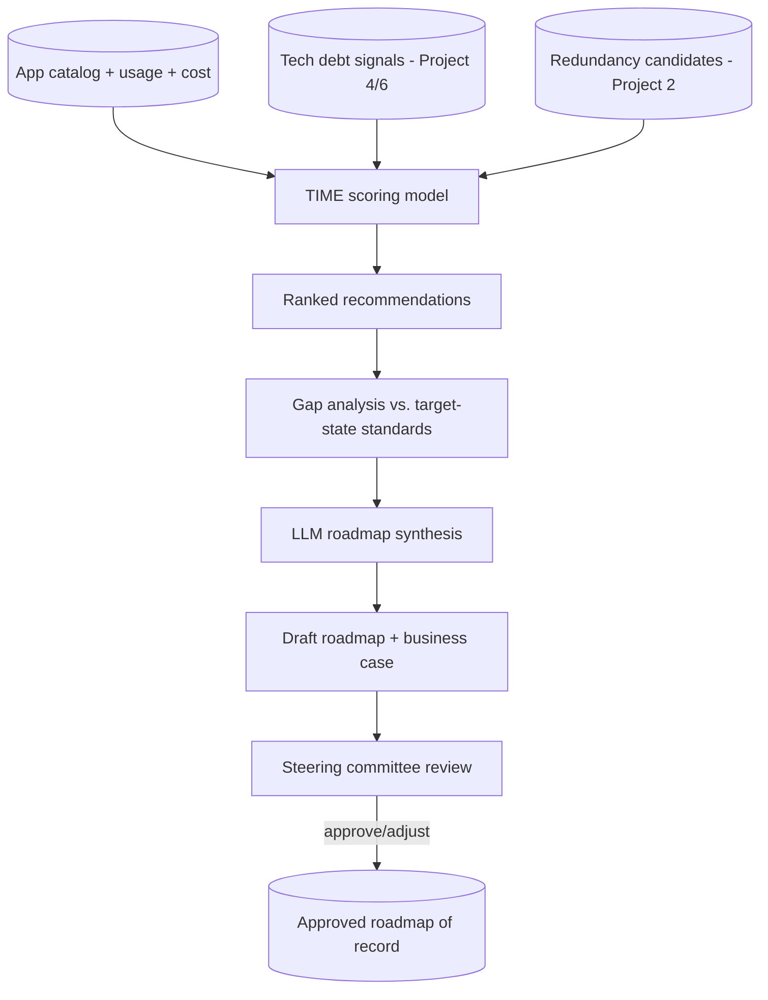

# AI-Augmented Application Rationalization & Modernization Roadmap Advisor (Flagship)

> Part of the [Enterprise Architecture + AI Portfolio](../README.md) — see `../EA-AI-Portfolio-Blueprint.docx` (or `.md`) for the full specification, governance model, and (for Project 9) the complete 25-part implementation blueprint.

**Tier:** Flagship · **Repo name:** `ai-rationalization-roadmap-advisor`

**Enterprise Problem.** Rationalizing a portfolio (deciding what to Tolerate, Invest in, Migrate, or Eliminate) and sequencing the resulting modernization work is normally a slow, spreadsheet-heavy, consultant-driven exercise that's hard for a steering committee to challenge because the reasoning isn't transparent.

**Business Value.** Produces a defensible, evidence-linked rationalization scorecard and a sequenced modernization roadmap a CIO can actually take to a budget conversation. KPIs: % of portfolio with a current TIME classification; estimated run-cost reduction from Eliminate/Migrate candidates; roadmap drafting time (weeks → days); steering-committee approval cycle time.

**AI Use Case.** A scoring model combines usage, cost, technical debt (Project 4/6-style signals), and redundancy (Project 2) data into a TIME recommendation per application; a gap-analysis step compares current-state technology against target-state standards; an LLM synthesizes the scorecard into a sequenced, narrated roadmap with explicit trade-offs between options. **Not delegated to AI:** the actual budget commitment and final TIME decision per application — the tool produces a ranked, evidenced recommendation the governance board approves or overrides.

**Users.** CIO/CTO, enterprise architects, application portfolio managers, architecture steering committee.

**Example Scenario.** Twelve applications score as "Eliminate" candidates due to low usage, high technical debt, and confirmed redundancy with a newer platform; the advisor sequences them into a 3-wave modernization roadmap, front-loading the two highest-cost, lowest-risk eliminations, and drafts the business case narrative and estimated savings range for each wave — for the steering committee to approve, adjust, or reject wave by wave.

**Architecture.**

**EA Artifacts consumed:** application catalog, cost/usage data, technical debt findings, redundancy candidates, target-state technology standards. **Generated:** a rationalization scorecard, a sequenced modernization roadmap, and draft business-case narratives per wave.

**AI Techniques required:** a recommendation/scoring model (can be a transparent weighted model rather than a black-box classifier — explainability matters more than accuracy here), structured gap analysis (deterministic diff), LLM narrative synthesis for the roadmap and business case. *Not used:* agents (this is best built first as a scoring + synthesis pipeline; Project 9's agentic pattern is the natural next evolution, not a requirement here).

**Recommended Stack:** Python, pandas/scikit-learn for the scoring model (favor a transparent weighted-sum or decision-tree model over an opaque ensemble, specifically so the score is explainable to a steering committee), an LLM API for narrative synthesis, PostgreSQL, a dashboard (Streamlit or a small React app) for the scorecard and roadmap view.

**Data Model:** `Application(...)` (shared with Project 2) + `RationalizationScore(app_id, usage_score, cost_score, debt_score, redundancy_score, time_recommendation, confidence, rationale)` → `RoadmapWave(id, sequence, applications[], narrative, estimated_savings_range, status)`.

**AI Governance:** the scoring model's weights and inputs are fully visible and explainable — no black-box score presented to a steering committee without a "why" breakdown; every TIME recommendation is explicitly labeled a recommendation, with committee decision and rationale logged; savings estimates are presented as ranges with stated assumptions, never as guaranteed figures.

**Implementation Plan.**
- *Phase 1 (MVP):* transparent weighted scoring model over synthetic usage/cost data; simple ranked list output.
- *Phase 2 (AI capability):* integrate technical-debt and redundancy signals; add LLM-drafted per-application rationale text.
- *Phase 3 (EA intelligence):* add gap analysis against target-state standards and wave sequencing logic; LLM-drafted roadmap narrative and business case per wave.
- *Phase 4 (production-grade):* add scenario comparison (different sequencing strategies), sensitivity analysis on scoring weights, and export to steering-committee-ready formats.

**Repo Structure:** `/data/synthetic_portfolio`, `/src/scoring`, `/src/gap_analysis`, `/src/roadmap_synthesis`, `/app`, `/docs` (sample scorecard + roadmap), `/eval`, `README.md`.

**Portfolio Deliverables:** README, architecture diagram, sample scorecard and roadmap output, explainability write-up (how each score is computed), evaluation results, screenshots of the steering-committee view.

**Evaluation:** scoring model transparency/explainability (documented, not just claimed); ranking sensibility against hand-reasoned expectations on the synthetic portfolio; roadmap narrative faithfulness to the underlying scores; steering-committee-style review of a sample roadmap for plausibility.
