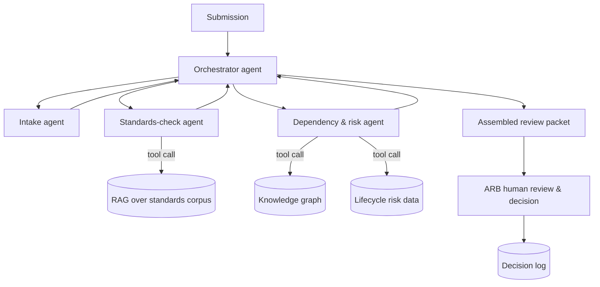

# Agentic Architecture Review Board Copilot (Flagship)

> Part of the [Enterprise Architecture + AI Portfolio](../README.md) — see `../EA-AI-Portfolio-Blueprint.docx` (or `.md`) for the full specification, governance model, and (for Project 9) the complete 25-part implementation blueprint.

**Tier:** Flagship · **Repo name:** `agentic-arb-copilot`

**Enterprise Problem.** Before an Architecture Review Board can apply judgment to a submission, someone has to read the design doc, check it against standards, assess risk, check for redundancy with existing systems, and assemble all of that into a review packet — work that consumes hours of architect time per submission before any actual governance decision happens.

**Business Value.** Compresses ARB pre-review preparation from hours to minutes per submission while making the review packet more consistent and evidence-linked than a manually assembled one. KPIs: ARB cycle time; reviewer prep hours per submission; consistency of findings across reviewers/submissions; % of submissions requiring rework due to a missed standard or risk.

**AI Use Case.** A small multi-agent workflow — Intake Agent (extracts structure from the submission), Standards-Check Agent (RAG-grounded compliance check, reusing Project 6), Dependency/Risk Agent (queries the knowledge graph from Project 5 and lifecycle risk from Project 4), and an Orchestrator Agent that assembles everything into one packet — each agent calling specific tools/APIs rather than freely improvising. **Not delegated to AI:** the review decision itself; the ARB always receives the assembled packet as *input to their judgment*, and nothing in the packet is labeled as a decision.

**Users.** Architecture Review Board members and secretariat, solution architects submitting for review.

**Example Scenario.** An architect submits a proposal to introduce a new customer-notification microservice. The Intake Agent extracts the design's data flows and technology choices; the Standards-Check Agent flags a messaging-pattern deviation with citation; the Risk Agent's graph query shows the service would create a new dependency on a technology already flagged as approaching end-of-support; the Orchestrator compiles a one-page packet with all three findings, each with its evidence and citation, ready for the board's Thursday review — instead of an architect spending the Tuesday before assembling it by hand.

**Architecture.** *(Full detail — including agent tool contracts, state management, and failure handling — is provided in the Step 4 deep-dive below. Summary:)*

**EA Artifacts consumed:** submitted solution architecture documents, standards corpus, dependency graph, technology lifecycle data. **Generated:** structured ARB review packets, and (after human decision) an ADR-ready record of the outcome.

**AI Techniques required:** multi-agent orchestration, tool/function calling (each agent calls a specific, scoped tool — no agent has open-ended access), RAG, knowledge-graph querying, structured outputs for the final packet. This is the one project in the portfolio where agentic orchestration is actually justified — the workflow genuinely has multiple specialized steps with different tools, unlike simpler projects where a single LLM call would suffice.

**Recommended Stack:** Python, LangGraph (or a comparable lightweight agent-orchestration framework — chosen deliberately over a heavier multi-agent platform for transparency and debuggability), FastAPI, the RAG store from Project 1/6, the Neo4j graph from Project 5, PostgreSQL for the packet/decision log, OpenTelemetry for tracing each agent step.

**Data Model:** `ReviewSubmission(id, title, document, submitted_by, status)` → `AgentRun(id, submission_id, agent_name, tool_calls[], output, duration_ms, status)` → `ReviewPacket(id, submission_id, findings[], assembled_at)` → `BoardDecision(id, packet_id, decision, rationale, decided_by, decided_at)`.

**AI Governance:** every agent's tool access is scoped and logged; the orchestrator cannot skip the human review step under any code path; every finding in the packet must carry its source (which agent, which tool call, which evidence); a full trace of the multi-agent run is retained for audit, since "why did the copilot say this" must always be answerable; prompt-injection risk from submitted documents is treated explicitly (submissions are untrusted input — the Standards-Check and Risk agents parse them for content extraction only, never execute instructions found inside a submission).

**Implementation Plan.**
- *Phase 1 (MVP):* single-agent version — one LLM call does intake + a basic standards check, no orchestration yet, to validate the core value before adding complexity.
- *Phase 2 (AI capability):* split into Intake/Standards-Check/Risk agents with real tool calls into the RAG store and graph; add the orchestrator.
- *Phase 3 (EA intelligence):* add full tracing/observability per agent step, failure/retry handling, and packet quality scoring.
- *Phase 4 (production-grade):* add prompt-injection test coverage, human-feedback capture on packet usefulness, and integration with Project 8's rationalization data for redundancy checks during intake.

*(Full 25-part blueprint, including all remaining sections, is provided in Step 4.)*
