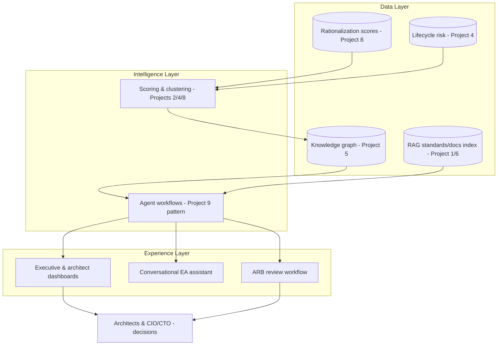

# Enterprise Architecture Intelligence Platform — "AI Command Center" (Flagship / Capstone)

> Part of the [Enterprise Architecture + AI Portfolio](../README.md) — see `../EA-AI-Portfolio-Blueprint.docx` (or `.md`) for the full specification, governance model, and (for Project 9) the complete 25-part implementation blueprint.

**Tier:** Flagship / Capstone · **Repo name:** `ea-intelligence-platform`

**Enterprise Problem.** Every project above solves one EA problem well, but in most organizations these problems compound because the underlying information — portfolio, dependencies, risk, compliance, documentation — lives in separate tools and separate mental models. No single place lets an architect ask "what does our landscape look like right now, and where is it under strain?" and get one coherent, current answer.

**Business Value.** Unifies portfolio rationalization, dependency/impact analysis, compliance monitoring, and documentation generation into one continuously current model, rather than periodic point-in-time exercises. KPIs: aggregate of all prior projects' KPIs viewed as one portfolio health picture; time from "architecture question" to "evidenced answer" across all supported question types; reduction in duplicated effort across previously siloed EA activities.

**AI Use Case.** This capstone doesn't introduce new AI techniques so much as it integrates every technique from Projects 1–9 around one shared knowledge graph and RAG substrate: portfolio rationalization (8) and dependency analysis (5) share the same application nodes; the ARB copilot (9) and compliance checker (6) share the same standards RAG index; lifecycle risk (4) and redundancy detection (2) both feed the rationalization scoring model. **Not delegated to AI:** identical governance boundary as every component project — this platform assembles evidence and surfaces recommendations across domains; it does not make or auto-execute architecture decisions anywhere in the stack.

**Users.** The full EA practice — enterprise, solution, business, data, cloud, and security architects — plus CIO/CTO for portfolio-level dashboards and the ARB for governed reviews.

**Example Scenario.** A CIO asks the platform, "Where is our architecture risk concentrated, and what would fixing it cost?" The platform's dashboard shows the knowledge graph's risk-weighted view (Project 4/5), cross-references it against rationalization scores (Project 8) to show which at-risk applications are also Eliminate/Migrate candidates (compounding the case for action), and offers to draft a roadmap narrative for the highest-concentration cluster (Project 8's synthesis) — with every number clickable back to its source finding.

**Architecture.**

**EA Artifacts consumed/generated:** effectively all artifacts from Projects 1–9, unified around the shared knowledge graph as the system of reference (never the system of record — source systems remain authoritative).

**AI Techniques required:** every technique used in Projects 1–9, deliberately reused rather than reinvented, plus a top-level conversational orchestrator that routes a question to the right sub-system (RAG for policy questions, graph queries for impact questions, scoring views for rationalization questions, agent workflows for ARB packets).

**Recommended Stack:** builds directly on the stacks of Projects 1, 2, 4, 5, 6, 8, and 9 — the integration work is the point of this project, not new infrastructure. Add an API gateway layer and a unified dashboard (React) as the new components.

**Data Model:** the union of all prior data models, with the knowledge graph (Project 5's schema) as the central spine that every other model's entities attach to.

**AI Governance:** inherits every governance control from the component projects, plus a platform-level audit log unifying "which sub-system produced this claim" across the whole experience, and a single, consistently enforced human-approval gate pattern regardless of which sub-system originated a recommendation.

**Implementation Plan.**
- *Phase 1 (MVP):* wire Projects 1 and 5 together (RAG + knowledge graph) behind one conversational front end.
- *Phase 2 (AI capability):* add Projects 2, 4, and 6 as additional intelligence feeding the same graph.
- *Phase 3 (EA intelligence):* integrate Project 8's rationalization scoring and roadmap synthesis as a dashboard view.
- *Phase 4 (production-grade):* integrate Project 9's agentic ARB workflow as the platform's governed decision-support workflow, with the unified audit trail across everything.

**Portfolio Deliverables:** a single README that explicitly maps which sub-project powers which platform capability (this traceability is itself the strongest portfolio artifact — it shows systems thinking, not just nine separate demos bolted together); one architecture diagram showing the whole platform; a recorded walkthrough demo.

**Evaluation:** platform-level evaluation is the aggregate of each component's evaluation, plus an end-to-end scenario test (the CIO question above) demonstrating cross-component reasoning actually works, not just that each piece works in isolation.

**Résumé Bullets.**
- Architected an integrated Enterprise Architecture Intelligence Platform unifying portfolio rationalization, dependency analysis, compliance checking, and agentic governance workflows around a shared knowledge graph.
- Demonstrated a full-stack AI-augmented EA capability spanning RAG, knowledge graphs, scoring models, and multi-agent orchestration, with a consistent human-approval governance boundary enforced across every sub-system.

**Interview Story.** *Problem:* EA information is fragmented across tools that don't talk to each other. *Constraints:* integration must not weaken any individual component's governance boundary. *Architecture:* a shared knowledge-graph spine with every prior project's intelligence attached to it. *AI approach:* explicitly a systems-integration story, not a new-technique story — the sophistication is in the architecture, not in adding more AI. *Governance:* one consistent audit/approval pattern platform-wide. *Trade-offs:* discussed the real engineering cost of integration vs. keeping systems separate, and why a capstone project is the right place to demonstrate that trade-off is worth making. *Results:* end-to-end scenario walkthrough on synthetic data, framed honestly as a capstone prototype, not a production platform claim.
